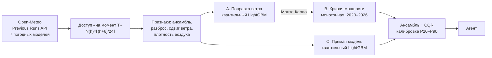
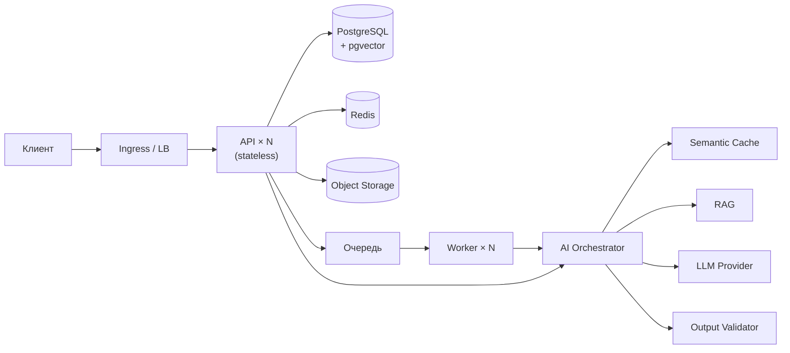

# hack-9013145c-opentowork

> Требования к содержанию README — п. 5.4.15 Положения; если эксперт не сможет
> поднять проект по этой инструкции, команда не допускается до дальнейшего отбора (п. 5.4.16).

## Описание решения

Агентная система почасового прогноза выработки ветроэлектростанции на 24–48 часов.
Агент сам получает по координатам ВЭС архивные прогнозы 7 мировых погодных моделей
(ECMWF IFS и нейросетевая ECMWF AIFS, ICON, GFS, UKMO, GEM, CMA) — только те выпуски,
что были опубликованы к моменту прогноза, — проверяет их, запускает вероятностную
ML-модель, анализирует результат (резкие перепады, обледенение, расхождение моделей)
и пересчитывает прогноз при выходе нового выпуска погоды. Для диспетчера ВЭС это
почасовой график с интервалом P10–P90 и текстовая сводка; на годовом бэктесте ошибка
на 56% ниже «как вчера» и на 7,9% ниже прогноза «сырая погода + кривая мощности».

**Задача хакатона:** Agentic AI для прогнозирования выработки ВЭС (трек «Энергетика»)
**Команда:** OpenToWork

> ML-контур и его запуск — раздел [«Прогноз ВЭС: как воспроизвести»](#прогноз-вэс-как-воспроизвести).

## Быстрый старт

**Новая турбина:** «Новая площадка → Ветровые станции» (`/#/place/wind`).
Выбор точки на карте Казахстана, модели и высоты → расчёт выработки на 24–48 ч
по текущей погоде. Турбины можно сохранять в браузере и сравнивать.
Модуль использует Open-Meteo и кривые windpowerlib; требует интернет у бэкенда.
[API, запуск и допущения](docs/new-wind-turbines.md).

```bash
git clone <repo-url> && cd hack-9013145c-opentowork
cp .env.example .env
docker compose up -d
```

Или через `make`: `make up` (поднимет и дождётся готовности), `make help` — все команды.

При первой сборке Docker также обучает ML-модель; запуск может занять несколько минут:

| Что | Где |
|---|---|
| API + Swagger | http://localhost:8000/docs |
| Health check | http://localhost:8000/health |
| Readiness (проверка зависимостей) | http://localhost:8000/ready |
| Метрики Prometheus | http://localhost:8000/metrics |
| Frontend (веб-интерфейс) | http://localhost:3000 |
| MinIO консоль | http://localhost:9001 (`minioadmin` / `minioadmin`) |

Мониторинг (опционально):
```bash
docker compose --profile observability up -d   # Prometheus :9090, Grafana :3001 (admin/admin)
```
Grafana открывается сразу на готовом дашборде «HackAlem AI — экономика и качество»:
доля ответов из кэша, экономия в долларах, задержка по стадиям, отказы валидации,
пропускная способность воркеров. Источник данных и дашборд заводятся автоматически,
настраивать вручную ничего не нужно.

### Демо-доступ

Данные создаются автоматически при старте (`SEED_ON_START=true`), внешние аккаунты
не нужны:

```
email:    demo@demo.kz
password: demo1234
```

По умолчанию `LLM_MODE=mock` — приложение полностью работает **без интернета и без
API-ключей**. Для запуска с реальной моделью: `LLM_MODE=live` + `LLM_API_KEY=...` в `.env`.

## Проверка основного сценария

### Автоматически (одна команда)

```bash
python3 scripts/smoke_test.py
```

Скрипт проходит весь путь и печатает результат по пунктам: health/ready → вход под
демо-учёткой → отклонение запроса без токена → поиск по базе знаний → AI-ответ →
**попадание в семантический кэш** → блокировка prompt injection → оценка ответа →
сводка экономики → асинхронная задача через воркер → метрики → прогноз ВЭС →
what-if → Copilot с источником → проверка SCADA. Всего 21 проверка. Зависимостей не
требует, только stdlib.

Ожидаемый вывод:
```
  [PASS] Повтор попал в кэш — source=exact_cache за 25 мс (было 171 мс)
  [PASS] Перефразированный вопрос попал в семантический кэш — source=semantic_cache similarity=0.5987
  [PASS] Статистика считает попадания в кэш — hit_rate=0.6667 экономия=$0.005
  [PASS] Воркер обработал задачу — status=COMPLETED
  Все проверки пройдены — проект готов к сдаче.
```

### Вручную

Основной сценарий — прогноз ВЭС Нурлы:
1. Войти под демо-учёткой и открыть http://localhost:3000/#/forecast/wind/nurly.
2. Выбрать 7 февраля 2026 и горизонт 48 часов. Показать график мощности и P10–P90.
3. Переключить на 24 часа: число точек и горизонт должны измениться.
4. Открыть турбину: фактическая история берётся из SCADA организатора. За февраль
   измерений нет — интерфейс показывает отсутствие данных, а не синтетический факт.
5. Во вкладке «Бэктест» показать ошибку относительно базовых моделей. Метрики
   относятся к истории 02.2025–01.2026; факта тестового февраля нет.
6. Во вкладке «Агент» спросить «Когда ожидается пик выработки?» и
   «Что будет, если ветер окажется на 15% слабее?». Ответ содержит ID выпуска и
   список выполненных инструментов. Без ключа ответ формируется расчётным шаблоном;
   в live-режиме LLM получает рассчитанные факты с проверкой чисел.
7. Обновить прогноз. Живой пересчёт использует ML-стек; сохранённые выпуски доступны
   офлайн. Живой прогноз на текущую дату требует доступа к погодному сервису.

Дополнительные экраны — другие станции, СЭС и крыши — показывают возможности
расширения. Они не являются доказательством качества ML-модели на новых площадках.

Через API (то же самое в Swagger):
1. Открыть http://localhost:8000/docs, авторизоваться через `POST /api/v1/auth/login`
   демо-учёткой, скопировать `access_token` в кнопку Authorize.
2. `POST /api/v1/ai/chat` с телом `{"query": "...", "context": {"language": "ru"}}`.
3. Повторить тот же запрос, переформулировав вопрос своими словами.
4. Ожидаемый результат: во втором ответе `meta.source` = `semantic_cache`,
   а `meta.latency_ms` падает на порядок. `GET /api/v1/ai/stats` покажет долю
   запросов, снятых кэшем, и оценку сэкономленных денег.

Прогноз ВЭС через API (без авторизации, данные — артефакты агента из репозитория):
1. `GET /api/v1/forecast/latest?origin=2026-02-07` — прогноз на 48 ч с P10/P50/P90,
   шагами агента (`agent_steps`), сводкой (`explanation`) и всеми ревизиями за сутки (`versions`).
2. `GET /api/v1/forecast/latest?origin=2025-12-15` — прогноз из бэктеста вместе с фактом (`actual`).
3. `GET /api/v1/metrics` — метрики бэктеста; `GET /api/v1/forecast/days` — сводка по тестовому периоду.
4. `POST /api/v1/simulation` с `{"forecast_id": "<id из п.1>", "wind_change_pct": 10}` — what-if.

## Прогноз ВЭС: как воспроизвести

ML-контур лежит в пакете [`windcast/`](windcast/) и запускается отдельно от веб-стека —
ему нужен только Python 3.12. Архив погоды уже скачан в `artifacts/weather/` (4.6 МБ),
поэтому всё воспроизводится **без сети и без API-ключей**.

```bash
python -m pip install -e ".[dev,ml]"          # numpy, pandas, pyarrow, scikit-learn, lightgbm

python -m windcast quality                # качество данных турбин
python -m windcast backtest               # бэктест 02.2025–01.2026, 365 выпусков (~6 мин)
python -m windcast train                  # финальная модель: данные строго до 31.01.2026 00:00 UTC
python -m windcast test-period            # агент по тестовому периоду 31.01–27.02.2026 (~3 мин)
python -m windcast agent --origin 2026-02-07   # один день с трассировкой шагов агента
python -m pytest -q tests/test_windcast_*.py   # тесты: утечки будущего, решения агента, API

python -m windcast weather                # (необязательно) заново скачать архив из Open-Meteo
```

**Результат для проверки:** [`artifacts/forecasts/test_period_forecast.csv`](artifacts/forecasts/test_period_forecast.csv) —
28 выпусков (31.01…27.02, каждый в 00:00 UTC = 05:00 местного) × 48 часов:
`issue_time_utc, target_time_utc, target_time_local, horizon_h, p10, p50, p90, mean, p50_T1, p50_T2, …`.
Мощность — в долях номинала, как в исходных данных. Все версии прогноза, включая
ревизии агента в 06/12/18 UTC, — в `test_period_all_versions.csv`; полные прогоны
агента со всеми шагами и сводкой — `artifacts/forecasts/<дата>.json`.

### Как устроено



**1. Только прогнозы, доступные на момент T.** Open-Meteo хранит для каждого часа
значение, предсказанное за 1, 2, 3… суток (`previous_dayN`). Выпуск публикуется
с задержкой, поэтому для горизонта h берётся только
`N(h) = ⌈(h + 6) / 24⌉` — выпуск, гарантированно опубликованный к T. Это одна
функция ([weather.py](windcast/weather.py)), и её проверяет тест
[test_windcast_leakage.py](tests/test_windcast_leakage.py): все значения архива,
опубликованные позже T, подменяются мусором — признаки прогноза не меняются ни на бит.
Обучение идёт на тех же архивных прогнозах, а не на факте погоды: модель учит
реальные ошибки погодных моделей на этой площадке.

**2. Модели.**
- **Каскад**: A — квантильный LightGBM исправляет ансамблевый прогноз ветра до
  измеренного ветра у турбины; B — монотонная по ветру кривая мощности (ветер,
  температура, турбина), обученная на всей истории 2023–2026 (~50 тыс. часов).
  Распределение ветра из A прогоняется через кривую B выборками Монте-Карло.
- **Прямая модель**: квантильный LightGBM «погода → мощность».
- **Ансамбль**: веса по дню выпуска N и CQR-калибровка интервалов подбираются только
  на прогнозах прошлых месяцев.
- **Baseline**: «как вчера», климатология, сырой ансамблевый прогноз ветра + кривая мощности.

Время в CSV — местное UTC+5 (найдено по максимуму корреляции с погодой в UTC).
Часы простоя и ограничений (ветер ≥ 4.5 м/с при нулевой мощности, выработка ниже
кривой на 30% номинала) из обучения исключены: модель прогнозирует доступную мощность.

**3. Агент** ([windcast/agent/](windcast/agent/)) — граф с явными переходами:

| Узел | Что решает |
|---|---|
| Планировщик | какой выпуск погоды свежайший на момент T |
| Сборщик погоды | сколько погодных моделей доступно, какие дни выпуска используются |
| Контроль качества | нет данных → откат на предыдущий выпуск; расхождение моделей, риск обледенения |
| Прогнозист | запуск ансамбля |
| Критик | пересечение квантилей, выход за [0, 1], пропуски часов → запасной прогноз |
| Аналитик | резкие перепады (≥ 30% номинала за 3 ч), часы низкой уверенности, выработка по суткам |
| Ревизор | вышел новый выпуск погоды → пересчёт; публикуется ревизия, только если P50 сдвинулся существенно |
| Отчёт | сводка оператору: шаблон, либо LLM при `ANTHROPIC_API_KEY` — числа в тексте LLM сверяются с фактами, при выдуманном числе остаётся шаблон |

Прогноз на сутки выпускается в 00 UTC; в 06, 12 и 18 UTC агент проверяет, стали ли
для целевых часов доступны более свежие выпуски погоды, и пересчитывает.

### Результаты бэктеста

Протокол как в тестовом периоде: каждый месяц с 02.2025 по 01.2026 модели
переобучаются на данных строго до его начала, прогноз выпускается ежедневно в 00 UTC
на 48 ч. 365 выпусков, 2 турбины. MAE и RMSE — в долях номинала, считаются по всем
часам с фактом, включая простои.

| Модель | MAE | RMSE | Лучше «сырой погоды + кривой» | Покрытие P10–P90 | P5–P95 |
|---|---|---|---|---|---|
| **Ансамбль (итоговая)** | **0.1584** | 0.2353 | **+7.9%** | **81.4%** | **90.5%** |
| Каскад | 0.158 | 0.237 | +7.9% | 72.0% | 83.2% |
| Прямая LightGBM | 0.160 | 0.233 | +6.9% | 67.4% | 82.0% |
| Сырой прогноз ветра + кривая мощности | 0.172 | 0.254 | — | — | — |
| Климатология (месяц × час) | 0.310 | 0.354 | −80% | — | — |
| «Как вчера» | 0.363 | 0.477 | −111% | — | — |

- Точность падает с давностью выпуска погоды: MAE 0.148 / 0.160 / 0.180 для
  выпусков за 1 / 2 / 3 суток.
- Выигрыш над сырой погодой зависит от сезона: 19% в январе 2026, 17% в феврале 2025,
  около нуля летом (в июле 2025 ансамбль на 3% хуже). Вероятная причина — зимние
  инверсии, в которых сырой прогноз ветра на высоте ступицы ошибается систематически;
  отдельно мы это не проверяли.
- Калибровка интервалов работает: у отдельных моделей P10–P90 покрывали 67–72% фактов,
  у откалиброванного ансамбля — 81.4% при цели 80%.
- Полные метрики (по горизонту, месяцам, диаграмма надёжности): `artifacts/reports/backtest_summary.json`.

**Ограничения.** Факта за февраль 2026 в данных нет, поэтому качество тестового
периода оценить нельзя — оно оценено бэктестом на тех же зимних месяцах. Архив
прогнозов в Open-Meteo начинается с 2024 года, AIFS — с февраля 2025, поэтому модель
погоды → мощность учится примерно на 2 годах. Номинальная мощность турбин в данных
не указана, поэтому выработка дана в долях номинала, а не в МВт·ч.

## Архитектура

Модульный монолит + асинхронные воркеры + AI-слой с семантическим кэшем и валидацией
выхода LLM. Stateless API, горизонтальное масштабирование, готовые манифесты Kubernetes.



**Заблудились в проекте? Начните с [`context/`](context/README.md)** — карта файлов,
список фич, рецепты «как сделать X» и разбор поломок.

Архитектурные обоснования — в [`docs/`](docs/00-index.md):

| Документ | О чём |
|---|---|
| [01 Архитектура](docs/01-architecture-overview.md) | принципы, модули, схема |
| [02 AI/LLM](docs/02-ai-llm-pipeline.md) | оркестратор, semantic cache, RAG, валидация и guardrails |
| [03 Данные](docs/03-database-schema.md) | ER-схема, pgvector, job lifecycle |
| [04 API](docs/04-api-specification.md) | эндпоинты, ошибки, идемпотентность |
| [05 Деплой](docs/05-deployment-and-kubernetes.md) | Docker, K8s, HPA, CI/CD |
| [06 Безопасность](docs/06-security-observability.md) | auth, RBAC, rate limit, логи, метрики |
| [07 План](docs/07-hackathon-execution-plan.md) | план работ и чек-листы команды |

## Технологии

| Слой | Выбор |
|---|---|
| Backend | Python 3.12, FastAPI, Pydantic v2, SQLAlchemy 2, Alembic |
| Frontend | React 18, TypeScript, Vite, nginx (проксирует `/api` на бэкенд) |
| БД | PostgreSQL 16 + pgvector (векторный поиск и semantic cache) |
| Кэш / очередь | Redis 7 (exact cache, rate limit, Redis Streams) |
| Хранилище | S3-совместимое (MinIO локально) |
| AI | Абстракция `LLMProvider` (Anthropic / OpenAI / локальные / mock), эмбеддинги, RAG |
| Инфраструктура | Docker, docker-compose, Kubernetes (Deployment, HPA, Ingress), GitHub Actions |
| Наблюдаемость | structlog (JSON), Prometheus, Grafana |

## Развёртывание в Kubernetes

```bash
kubectl apply -k infra/k8s/          # боевой кластер
kubectl apply -k infra/k8s-local/    # локальный кластер: mock-режим, 1 реплика
kubectl -n hackalem rollout status deploy/api
```

Включает: API с liveness/readiness/startup-пробами, воркеры, фронтенд, миграции
отдельной задачей, PostgreSQL + pgvector, Redis, MinIO, HPA (API 2→10,
воркеры 1→20), Ingress с TLS, PodDisruptionBudget, rolling update без простоя.

**Что проверено запуском, а что нет** — честно расписано в
[context/06-kubernetes.md](context/06-kubernetes.md). Коротко: локальный оверлей
`infra/k8s-local/` развёрнут на живом кластере, `smoke_test.py` прошёл 15 из 15
проверок против него, HPA отмасштабировал API 2→4 реплики за 30 секунд.
Базовый набор `infra/k8s/` собирается и валидируется API-сервером
(`kubectl apply --dry-run=server`), но в боевом кластере не разворачивался:
для него нужны свой registry, домен и секреты.
Обоснование решений — [docs/05](docs/05-deployment-and-kubernetes.md).

## Переменные окружения

Полный список с комментариями — [`.env.example`](.env.example). Ключевые:

| Переменная | Назначение | По умолчанию |
|---|---|---|
| `DATABASE_URL` | подключение к PostgreSQL | из docker-compose |
| `REDIS_URL` | подключение к Redis | из docker-compose |
| `LLM_MODE` | `live` — реальный провайдер, `mock` — работа без ключей | `mock` |
| `LLM_API_KEY` | ключ провайдера (только для `live`) | — |
| `SEMANTIC_CACHE_THRESHOLD` | порог косинусной близости для попадания в кэш | `0.92` |
| `SEMANTIC_CACHE_TTL` | время жизни записи кэша, сек | `86400` |
| `CACHE_CONTEXT_FIELDS` | поля контекста, различающие запросы | `language,region` |
| `RAG_TOP_K` | сколько документов подаётся в промпт | `5` |
| `RATE_LIMIT_AI` | лимит AI-запросов в минуту на пользователя | `20` |
| `RATE_LIMIT_LOGIN` | попыток входа в минуту на один email | `10` |
| `SEMANTIC_CACHE_SCOPE` | `global` — общий кэш; `user` — ключ включает владельца запроса | `global` |
| `SEMANTIC_CACHE_MAX_ROWS` | сверх этого воркер вытесняет самые холодные записи | `50000` |
| `JWT_SECRET` | подпись токенов (**обязательно сменить в проде**) | — |

## Разработка

Бэкенд:
```bash
uv sync --extra dev --extra ml             # зависимости и тесты ML
docker compose up -d postgres redis minio # только инфраструктура
uv run alembic upgrade head               # миграции
uv run uvicorn app.main:app --reload      # API с автоперезагрузкой
uv run pytest -q                          # тесты
uv run ruff check .                       # линтер
```

Фронтенд:
```bash
cd frontend && npm install
npm run dev                               # http://localhost:5173, /api проксируется на :8000
```

На Windows без локального Python-окружения тесты и линтер удобнее гонять в контейнере:
```bash
make test-docker
```

## Сторонние компоненты и лицензии

Раскрытие по п. 5.4.4 Положения.

| Компонент | Лицензия | Как используется |
|---|---|---|
| FastAPI | MIT | HTTP-слой |
| SQLAlchemy, Alembic | MIT | ORM и миграции |
| pgvector | PostgreSQL License | векторный поиск |
| Redis | RSALv2/SSPL (образ), клиент MIT | кэш, очередь |
| MinIO | AGPLv3 (только локальная среда разработки) | S3-совместимое хранилище |
| Prometheus, Grafana | Apache 2.0 / AGPLv3 | мониторинг |
| React, React DOM | MIT | веб-интерфейс |
| Vite, TypeScript | MIT / Apache 2.0 | сборка фронтенда |
| nginx | BSD-2-Clause | раздача статики и прокси `/api` |
| Open-Meteo Previous Runs API | данные CC BY 4.0 | архив прогнозов погоды, кэш в `artifacts/weather/` |
| ECMWF IFS/AIFS, DWD ICON, NOAA GFS, UKMO, GEM, CMA | через Open-Meteo, CC BY 4.0 | исходные погодные модели |
| LightGBM | MIT | квантильные модели поправки ветра, кривой мощности, прямая модель |
| NumPy, pandas, scikit-learn | BSD-3-Clause | обработка данных |
| PyArrow | Apache 2.0 | кэш parquet |
| Данные турбин 1 и 2 (03.2023–01.2026) | предоставлены организатором | обучение и бэктест, `datasets/` |

Вся основная функциональность решения разработана в течение соревновательной части
23.09.2026. Инфраструктурный каркас и шаблоны подготовлены заранее в соответствии
с п. 5.4.4.2 Положения.

## Команда

| Участник | Роль |
|---|---|
| <!-- ЗАПОЛНИТЬ --> | |
