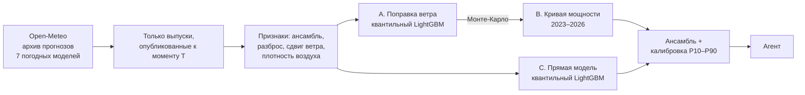
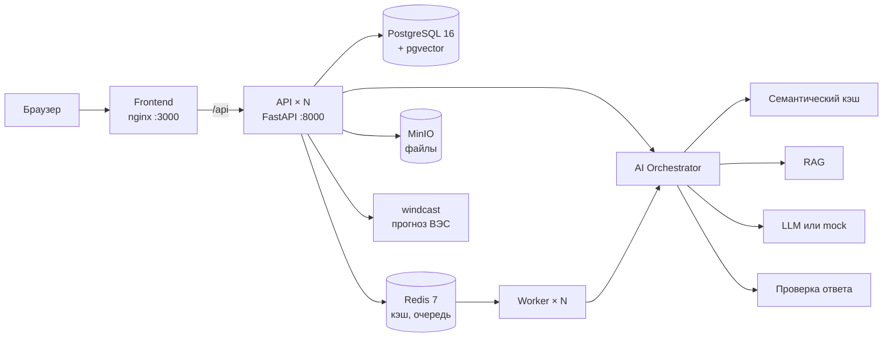

# Renewable Twin — прогноз выработки ветроэлектростанции

Команда **OpenToWork** · трек «Энергетика» · задача «Agentic AI для прогнозирования выработки ВЭС».

Система строит почасовой прогноз выработки ВЭС на 24–48 часов с интервалом
неопределённости P10–P90. Агент сам берёт по координатам станции архивные прогнозы
7 погодных моделей (ECMWF IFS, ECMWF AIFS, ICON, GFS, UKMO, GEM, CMA) — только те
выпуски, которые уже были опубликованы к моменту прогноза, — проверяет их, запускает
ML-модель, ищет в результате риски (резкие перепады, обледенение, расхождение
погодных моделей) и пересчитывает прогноз, когда выходит новый выпуск погоды.

На годовом бэктесте ошибка прогноза на 7,9% ниже, чем у подхода «сырой прогноз ветра +
кривая мощности», и на 56% ниже, чем у прогноза «как вчера».

**Демо-стенд:** http://89.126.192.240:3000 (API: http://89.126.192.240:8000/docs)

## Содержание

- [Что умеет](#что-умеет)
- [Быстрый запуск](#быстрый-запуск)
- [Как проверить](#как-проверить)
- [ML-модель: как воспроизвести](#ml-модель-как-воспроизвести)
- [Черновик заявки в РФЦ](#черновик-заявки-в-рфц)
- [Как устроен прогноз](#как-устроен-прогноз)
- [Результаты бэктеста](#результаты-бэктеста)
- [Архитектура](#архитектура)
- [Структура репозитория](#структура-репозитория)
- [Разработка](#разработка)
- [CI/CD и деплой на сервер](#cicd-и-деплой-на-сервер)
- [Переменные окружения](#переменные-окружения)
- [Kubernetes](#kubernetes)
- [Если что-то не работает](#если-что-то-не-работает)
- [Сторонние компоненты и лицензии](#сторонние-компоненты-и-лицензии)

## Что умеет

| Раздел | Что делает | Нужен интернет |
|---|---|---|
| **Прогноз ВЭС Нурлы** | почасовой прогноз на 24/48 ч с P10–P90 по двум турбинам, 3D-сцена станции, история из SCADA, what-if «ветер на N% сильнее/слабее» | нет — прогнозы тестового периода 31.01–27.02.2026 лежат в репозитории |
| **Точность прогноза** | бэктест за 02.2025–01.2026 в сравнении с базовыми моделями | нет |
| **Агент и Copilot** | шаги агента, происхождение прогноза, ответы на вопросы о прогнозе со ссылкой на выпуск | нет (в режиме `mock`) |
| **Прогнозы по всем ВЭС** | прогноз на 48 ч для 36 ВЭС Казахстана с координатами, посчитанный на текущей погоде | да, Open-Meteo |
| **Живой прогноз Нурлы** | пункт «Сейчас · живой прогноз» в выборе даты | да |
| **Ветер у станции** | скорость на 10 и 100 м, направление, порывы, риск обледенения | да, для дат вне тестового периода |
| **Солнечные станции** | 26 СЭС Казахстана из OpenStreetMap и прогноз по радиации | да |
| **Новая турбина** | расчёт выработки виртуальной турбины в любой точке по текущей погоде | да |
| **Панели на крышах** | 481 здание Астаны: сколько панелей поместится, выработка за год с учётом теней | нет |
| **Черновик заявки в РФЦ** | суточная заявка на продажу в PDF/DOCX/CSV из прогноза агента | нет |
| **AI-платформа** | чат с RAG, семантический кэш, проверка ответов LLM, фоновые задачи, метрики | нет (в режиме `mock`) |

## Быстрый запуск

### Что нужно

- Docker с Docker Compose v2 (Docker Desktop на macOS и Windows).
- Свободные порты: `3000`, `8000`, `5432`, `6379`, `9000`, `9001`.
- Интернет на время первой сборки: скачиваются образы и зависимости.

API-ключи и внешние аккаунты не нужны.

### Запуск

```bash
git clone https://github.com/BAITC-Hacks/hack-9013145c-opentowork.git
cd hack-9013145c-opentowork
cp .env.example .env
docker compose up -d --build
```

На Windows вместо `cp` используйте `copy .env.example .env`.

Первая сборка занимает несколько минут: кроме зависимостей, Docker обучает ML-модель
(около минуты). Следующие сборки идут быстрее — обучение повторяется, только если
изменились данные или код модели.

Стек готов, когда `docker compose ps` показывает `healthy` у `api`, `frontend` и `worker`,
а http://localhost:8000/health отвечает `{"status":"ok",...}`.

| Что | Адрес |
|---|---|
| Веб-интерфейс | http://localhost:3000 |
| API и Swagger | http://localhost:8000/docs |
| Health check | http://localhost:8000/health |
| Проверка зависимостей | http://localhost:8000/ready |
| Метрики Prometheus | http://localhost:8000/metrics |
| Консоль MinIO | http://localhost:9001 (`minioadmin` / `minioadmin`) |

### Вход

Демо-пользователь и демо-данные создаются автоматически при первом старте:

```
email:    demo@demo.kz
password: demo1234
```

### Режим без интернета и ключей

По умолчанию `LLM_MODE=mock`: вместо внешней LLM работает встроенный провайдер,
вместо внешних эмбеддингов — локальные. Чат, кэш, RAG, агент и Copilot работают без
интернета. Чтобы подключить настоящую модель, укажите в `.env`:

```
LLM_MODE=live
LLM_API_KEY=ваш_ключ
```

и перезапустите: `docker compose up -d`.

### Мониторинг (по желанию)

```bash
docker compose --profile observability up -d
```

Prometheus — http://localhost:9090, Grafana — http://localhost:3001 (`admin` / `admin`).
Grafana сразу открывает готовый дашборд: доля ответов из кэша, экономия, задержки
по стадиям, отказы валидации, работа воркеров.

### Остановка и сброс

```bash
docker compose down        # остановить
docker compose down -v     # остановить и удалить все данные (БД, кэш, файлы)
```

С `make`: `make up`, `make down`, `make reset` (полный сброс + проверка), `make help` —
все команды.

## Как проверить

### Автоматически

```bash
python3 scripts/smoke_test.py
```

Нужен только Python 3, сторонние пакеты не требуются. Скрипт проходит основной путь
и печатает `PASS` или `FAIL` по каждой проверке:

- health и ready, вход демо-пользователем, отказ без токена;
- поиск по базе знаний, ответ AI, попадание повторного и перефразированного вопроса в кэш,
  блокировка prompt injection, оценка ответа, статистика экономии;
- фоновая задача через воркер, метрики Prometheus;
- прогноз ВЭС: 48 согласованных квантилей, горизонт 24 ч, what-if, Copilot со ссылкой
  на выпуск, история из SCADA, отсутствие выдуманного факта за февраль.

В конце: `Все проверки пройдены — проект готов к сдаче.`

Для другого адреса: `python3 scripts/smoke_test.py --base http://89.126.192.240:8000`.

### Вручную в интерфейсе

1. Откройте http://localhost:3000 и войдите демо-пользователем.
2. **Ветровая энергия** в верхнем меню → карта ВЭС Казахстана → **ВЭС Нурлы**
   (или сразу http://localhost:3000/#/forecast/wind/nurly).
3. В поле **«Дата прогноза»** выберите день тестового периода, например 07.02.2026.
   Появятся график мощности с коридором P10–P90 и 3D-сцена станции.
4. Переключите горизонт **24 ч / 48 ч** — график и число часов изменятся.
5. Нажмите на турбину: откроется её история из SCADA. За февраль 2026 измерений
   нет, и интерфейс показывает именно отсутствие данных.
6. Блок **«Что если»** — пересчёт того же выпуска при изменении ветра.
7. Вкладка **«Точность прогноза»** — ошибка модели в сравнении с базовыми подходами
   на истории 02.2025–01.2026.
8. Вкладка **«Как считается»** — шаги агента, происхождение прогноза и **AI Copilot**.
   Задайте вопрос, например «Когда ожидается пик выработки?» или «Что будет, если
   ветер окажется на 15% слабее?». В ответе есть ID выпуска и список выполненных
   расчётов. В режиме `mock` текст собирается шаблоном из рассчитанных чисел;
   в режиме `live` эти числа получает LLM, а числа в её ответе сверяются с расчётом.
9. **Прогнозы** в верхнем меню — прогноз по всем ВЭС на текущей погоде (нужен интернет).
10. **Панели на крышах** — выберите здание, чтобы увидеть число панелей, выработку и тени.
11. Внизу страницы **«Платформа и инструменты»** — AI-платформа: запрос, база знаний,
    фоновый анализ, метрики. Задайте вопрос, затем тот же вопрос другими словами:
    второй ответ придёт из семантического кэша, и задержка упадёт на порядок.

### Через API

Прогнозы ВЭС отдаются без авторизации:

```bash
# прогноз на 48 ч: P10/P50/P90, шаги агента, сводка, все ревизии за сутки
curl "http://localhost:8000/api/v1/forecast/latest?origin=2026-02-07"

# прогноз из бэктеста вместе с фактом
curl "http://localhost:8000/api/v1/forecast/latest?origin=2025-12-15"

# метрики бэктеста и сводка по тестовому периоду
curl http://localhost:8000/api/v1/metrics
curl http://localhost:8000/api/v1/forecast/days

# what-if: forecast_id взять из ответа первого запроса
curl -X POST http://localhost:8000/api/v1/simulation \
  -H "Content-Type: application/json" \
  -d '{"forecast_id": "<id>", "wind_change_pct": 10}'

# черновик заявки в РФЦ
curl -o zayavka.pdf "http://localhost:8000/api/v1/bids/2026-02-07/file?format=pdf"
```

AI-чат требует токен:

```bash
TOKEN=$(curl -s -X POST http://localhost:8000/api/v1/auth/login \
  -H "Content-Type: application/json" \
  -d '{"email":"demo@demo.kz","password":"demo1234"}' | python3 -c "import json,sys;print(json.load(sys.stdin)['access_token'])")

curl -X POST http://localhost:8000/api/v1/ai/chat \
  -H "Authorization: Bearer $TOKEN" -H "Content-Type: application/json" \
  -d '{"query": "Как рассчитывается прогноз?", "context": {"language": "ru"}}'
```

Повторите запрос, переформулировав вопрос: в ответе `meta.source` станет
`semantic_cache`, а `meta.latency_ms` заметно уменьшится. `GET /api/v1/ai/stats`
показывает долю запросов из кэша и оценку сэкономленных денег.

Полный список эндпоинтов — в Swagger: http://localhost:8000/docs.

## ML-модель: как воспроизвести

ML-часть лежит в пакете [`windcast/`](windcast/) и запускается без веб-стека. Нужен
Python 3.12 или новее. Архив прогнозов погоды уже скачан в `artifacts/weather/`,
поэтому всё воспроизводится без сети.

```bash
python -m venv .venv && source .venv/bin/activate     # Windows: .venv\Scripts\activate
pip install -e ".[dev,ml]"

python -m windcast quality                # качество данных турбин
python -m windcast backtest               # бэктест 02.2025–01.2026, 365 выпусков (~6 мин)
python -m windcast train                  # итоговая модель на данных до 31.01.2026 00:00 UTC
python -m windcast test-period            # прогноз на тестовый период 31.01–27.02.2026 (~3 мин)
python -m windcast agent --origin 2026-02-07   # один день с выводом шагов агента
python -m windcast bids                   # черновики заявок в РФЦ на 01.02–28.02
python -m windcast bid --day 2026-02-07 --sender "ТОО …" --rated-mw 2.5   # одна заявка
python -m windcast weather                # необязательно: заново скачать архив погоды

pytest -q tests/test_windcast_*.py        # тесты: утечка будущего, агент, API
```

**Главный результат:** [`artifacts/forecasts/test_period_forecast.csv`](artifacts/forecasts/test_period_forecast.csv) —
28 выпусков (31.01…27.02.2026, каждый в 00:00 UTC = 05:00 Астаны) × 48 часов.
Колонки: `issue_time_utc, target_time_utc, target_time_local, horizon_h, p10, p50, p90, mean, p50_T1, p50_T2, …`.
Мощность дана в долях номинала, как в исходных данных.

Дополнительно:
- `artifacts/forecasts/test_period_all_versions.csv` — все версии прогноза, включая
  пересчёты агента в 06, 12 и 18 UTC;
- `artifacts/forecasts/<дата>.json` — полный прогон агента за день со всеми шагами;
- `artifacts/reports/backtest_summary.json` — метрики бэктеста по горизонтам и месяцам.

## Черновик заявки в РФЦ

Из прогноза агента собирается черновик **заявки на продажу** электроэнергии по форме
приложения 7 Правил организации и функционирования оптового рынка электрической
энергии (приказ Минэнерго РК, V1500010531): отправитель, получатель — единый закупщик
(РФЦ), операция «Продажа», 24 часовых объёма в МВт с точностью до тысячных.

Готовые файлы: `artifacts/bids/<дата>/zayavka_<дата>.{pdf,docx,csv,json}`,
через API — `GET /api/v1/bids/2026-02-07/file?format=pdf`.

- **Срок подачи:** до 08:00 по Астане накануне суток поставки. В заявку идёт последний
  выпуск прогноза до срока — выпуск 00 UTC (05:00 Астаны); для суток поставки это
  горизонты 19–43 ч.
- **Корректировки:** пересчёты агента в 06, 12 и 18 UTC превращаются в черновики
  корректировок, если прогноз сдвинулся не меньше чем на 10% установленной мощности:
  час, направление, объём, «было → стало», крайний срок подачи (за 2 часа до часа).
- **Справочно:** коридор P10–P90 по каждому часу и риски суток.
- Все объёмы считает код. LLM к заявке не допускается.

Документ помечен «ЧЕРНОВИК»: настоящая заявка подаётся в системе рынка с ЭЦП,
интеграции с ней нет. Допущения напечатаны в самом документе: номинал турбины 2,5 МВт
(в данных не указан, меняется через `--rated-mw`), собственное потребление 0,
час «01:00» формы = интервал 00:00–01:00 по Астане.

## Как устроен прогноз



**1. Никаких данных из будущего.** Open-Meteo хранит для каждого часа значения,
предсказанные за 1, 2, 3… суток. Выпуск погоды публикуется с задержкой, поэтому для
горизонта `h` берётся только выпуск `N(h) = ⌈(h + 6) / 24⌉` суток назад — он точно
опубликован к моменту прогноза. Это правило живёт в одной функции
([windcast/weather.py](windcast/weather.py)). Тест
[test_windcast_leakage.py](tests/test_windcast_leakage.py) заменяет мусором все значения,
опубликованные позже момента прогноза, и проверяет, что признаки не меняются.
Модель учится на тех же архивных прогнозах, а не на фактической погоде, поэтому она
учит реальные ошибки погодных моделей на этой площадке.

**2. Модели.**
- **Каскад:** модель A поправляет ансамблевый прогноз ветра до ветра, измеренного
  у турбины; кривая B (монотонная по ветру, учитывает температуру и турбину)
  переводит ветер в мощность. Распределение ветра из A прогоняется через B
  методом Монте-Карло.
- **Прямая модель:** квантильный LightGBM «погода → мощность».
- **Ансамбль:** веса моделей и калибровка интервалов (CQR) подбираются только на
  прогнозах прошлых месяцев.
- **Базовые модели для сравнения:** «как вчера», климатология, сырой прогноз ветра +
  кривая мощности.

Время в исходных CSV — местное UTC+5. Часы простоя и ограничений (ветер ≥ 4,5 м/с
при нулевой мощности; выработка ниже кривой на 30% номинала) из обучения исключены:
модель прогнозирует доступную мощность.

**3. Агент** ([windcast/agent/](windcast/agent/)) — граф с явными переходами:

| Шаг | Что делает |
|---|---|
| Планировщик | выбирает самый свежий выпуск погоды на момент прогноза |
| Сборщик погоды | проверяет, сколько погодных моделей доступно и за какие дни |
| Контроль качества | нет данных — откат на предыдущий выпуск; отмечает расхождение моделей и риск обледенения |
| Прогнозист | запускает ансамбль |
| Критик | ловит пересечение квантилей, выход за [0, 1], пропуски часов — и переключает на запасной прогноз |
| Аналитик | находит резкие перепады (≥ 30% номинала за 3 ч), часы низкой уверенности, считает выработку по суткам |
| Ревизор | при выходе нового выпуска погоды пересчитывает прогноз; публикует ревизию, только если P50 заметно сдвинулся |
| Отчёт | пишет сводку оператору: шаблоном или через LLM; числа в тексте LLM сверяются с расчётом, при расхождении остаётся шаблон |

Прогноз на сутки выпускается в 00 UTC. В 06, 12 и 18 UTC агент проверяет, появились ли
более свежие выпуски погоды, и при необходимости пересчитывает.

## Результаты бэктеста

Каждый месяц с 02.2025 по 01.2026 модели переобучаются на данных строго до начала
месяца, прогноз выпускается ежедневно в 00 UTC на 48 ч. Всего 365 выпусков, 2 турбины.
MAE и RMSE — в долях номинала, по всем часам с фактом, включая простои.

| Модель | MAE | RMSE | Лучше «сырой погоды + кривой» | Покрытие P10–P90 | P5–P95 |
|---|---|---|---|---|---|
| **Ансамбль (итоговая)** | **0.1584** | 0.2353 | **+7.9%** | **81.4%** | **90.5%** |
| Каскад | 0.158 | 0.237 | +7.9% | 72.0% | 83.2% |
| Прямая LightGBM | 0.160 | 0.233 | +6.9% | 67.4% | 82.0% |
| Сырой прогноз ветра + кривая мощности | 0.172 | 0.254 | — | — | — |
| Климатология (месяц × час) | 0.310 | 0.354 | −80% | — | — |
| «Как вчера» | 0.363 | 0.477 | −111% | — | — |

- Чем старше выпуск погоды, тем больше ошибка: MAE 0.148 / 0.160 / 0.180 для выпусков
  за 1 / 2 / 3 суток.
- Выигрыш зависит от сезона: 19% в январе 2026, 17% в феврале 2025, около нуля летом
  (в июле 2025 ансамбль на 3% хуже). Вероятная причина — зимние инверсии, в которых
  сырой прогноз ветра на высоте ступицы ошибается систематически; отдельно это не проверялось.
- Калибровка работает: у отдельных моделей интервал P10–P90 накрывал 67–72% фактов,
  у откалиброванного ансамбля — 81,4% при цели 80%.

**Ограничения.** Факта за февраль 2026 в данных нет, поэтому качество на тестовом
периоде оценено бэктестом на тех же зимних месяцах прошлых лет. Архив прогнозов
Open-Meteo начинается с 2024 года, AIFS — с февраля 2025, так что модель учится
примерно на двух годах. Номинал турбин в данных не указан, поэтому выработка дана
в долях номинала, а не в МВт·ч.

## Архитектура

Модульный монолит на FastAPI, фоновые воркеры, AI-слой с семантическим кэшем
и проверкой ответов LLM. API не хранит состояние и масштабируется горизонтально,
воркеры масштабируются отдельно.



Путь AI-запроса: проверка ввода (prompt injection, персональные данные, длина) →
точный кэш в Redis → эмбеддинг → семантический кэш в pgvector → поиск по базе знаний →
LLM → проверка ответа по схеме и по источникам, с повтором → запасной ответ при
неудаче → запись в кэш.

Фронтенд обращается к API по относительному пути `/api`, nginx проксирует его на
бэкенд, поэтому отдельная настройка адреса и CORS не нужна.

Подробнее:

| Документ | О чём |
|---|---|
| [docs/01](docs/01-architecture-overview.md) | принципы и модули |
| [docs/02](docs/02-ai-llm-pipeline.md) | AI-слой: оркестратор, кэш, RAG, проверка ответов |
| [docs/03](docs/03-database-schema.md) | схема базы данных |
| [docs/04](docs/04-api-specification.md) | API, ошибки, авторизация |
| [docs/05](docs/05-deployment-and-kubernetes.md) | Docker, Kubernetes, CI/CD |
| [docs/06](docs/06-security-observability.md) | безопасность, логи, метрики |
| [docs/new-wind-turbines.md](docs/new-wind-turbines.md) | расчёт новых турбин |
| [context/](context/README.md) | карта файлов, список фич, рецепты, типовые поломки |

## Структура репозитория

| Путь | Что там |
|---|---|
| `app/` | бэкенд: API (`app/api/v1/`), AI-слой (`app/ai/`), кэш, RAG, воркеры, расчёт крыш (`app/solar/`) и новых турбин (`app/wind/`) |
| `windcast/` | ML-модель и агент прогноза ВЭС, CLI `python -m windcast` |
| `frontend/` | React + TypeScript + Vite, 3D-сцены на Three.js |
| `datasets/` | данные турбин от организатора (03.2023–01.2026) |
| `artifacts/` | архив погоды, прогнозы, отчёты бэктеста, заявки в РФЦ |
| `migrations/` | миграции базы данных (Alembic) |
| `infra/docker/` | Dockerfile бэкенда и фронтенда, Prometheus, Grafana |
| `infra/k8s/`, `infra/k8s-local/` | манифесты Kubernetes |
| `scripts/` | `smoke_test.py`, точка входа контейнера, сбор справочников |
| `tests/` | тесты |
| `.github/workflows/` | CI/CD |

## Разработка

### Бэкенд

```bash
python -m venv .venv && source .venv/bin/activate
pip install -e ".[dev,ml]"

docker compose up -d postgres redis minio   # только инфраструктура
alembic upgrade head                        # миграции
uvicorn app.main:app --reload               # API на :8000 с автоперезагрузкой
```

Для локального запуска API в `.env` замените хосты сервисов на `localhost`:
`postgres` → `localhost` в `DATABASE_URL`, `redis` → `localhost` в `REDIS_URL`,
`minio` → `localhost` в `S3_ENDPOINT`.

### Фронтенд

```bash
cd frontend
npm install
npm run dev          # http://localhost:5173, запросы /api уходят на :8000
```

### Тесты и линтер

```bash
pytest -q            # юнит-тесты, база и сеть не нужны
ruff check .         # линтер
make test-integration   # проверки доступа и изоляции кэша, нужен поднятый стек
```

На Windows без локального Python тесты и линтер можно запустить в контейнере:
`make test-docker` или

```bash
docker compose run --rm --no-deps -e RUN_MIGRATIONS=false -e SEED_ON_START=false --entrypoint sh api -c "pip install -q pytest pytest-asyncio ruff && python -m pytest -q -p no:cacheprovider && python -m ruff check ."
```

## CI/CD и деплой на сервер

Два workflow в GitHub Actions:

**[`ci.yml`](.github/workflows/ci.yml)** — на каждый пуш в любую ветку:
1. `test`: линтер `ruff` и юнит-тесты `pytest`. Зависимости ставятся через `uv` с кэшем.
2. `deploy` (только ветка `main` и только если тесты прошли): код копируется на сервер
   через `rsync`, там выполняется `docker compose up -d --build`, затем шаг ждёт, пока
   `:8000/health` и `:3000` ответят `200`. Если не ответили — шаг падает и печатает логи API.

Новый пуш отменяет незаконченные тесты той же ветки. Деплои не отменяются, а идут по очереди.

**[`checks.yml`](.github/workflows/checks.yml)** — долгие проверки, на pull request
и вручную (Actions → Full checks → Run workflow): интеграционные тесты с настоящими
PostgreSQL и Redis, поиск секретов, аудит зависимостей, статический анализ, сборка
образов и сканирование на уязвимости.

### Настройка автодеплоя

1. Создать ключ для деплоя и добавить его на сервер:
   ```bash
   ssh-keygen -t ed25519 -N '' -f ~/.ssh/opentowork_deploy -C github-actions-deploy
   ssh-copy-id -i ~/.ssh/opentowork_deploy.pub root@89.126.192.240
   ```
2. В GitHub: **Settings → Secrets and variables → Actions → New repository secret**,
   имя `DEPLOY_SSH_KEY`, значение — содержимое `~/.ssh/opentowork_deploy`
   (приватный ключ целиком).
3. Адрес сервера и папка (`/opt/opentowork`) заданы в `ci.yml`, ключ хоста сервера
   там же закреплён. При смене сервера поправить оба значения.

### Что лежит на сервере отдельно

Проект — в `/opt/opentowork`. Два файла живут только на сервере, деплой их не трогает:

- `.env` — настройки стенда;
- `docker-compose.override.yml` — оставляет PostgreSQL, Redis и MinIO доступными
  только с самого сервера:
  ```yaml
  services:
    postgres:
      ports: !override ["127.0.0.1:5432:5432"]
    redis:
      ports: !override ["127.0.0.1:6379:6379"]
    minio:
      ports: !override ["127.0.0.1:9000:9000", "127.0.0.1:9001:9001"]
  ```

### Деплой вручную

```bash
rsync -az --delete --exclude .git --exclude .env --exclude docker-compose.override.yml \
  --exclude node_modules --exclude .venv ./ root@89.126.192.240:/opt/opentowork/
ssh root@89.126.192.240 "cd /opt/opentowork && docker compose up -d --build"
```

## Переменные окружения

Полный список с комментариями — в [`.env.example`](.env.example). Основные:

| Переменная | Назначение | По умолчанию |
|---|---|---|
| `LLM_MODE` | `mock` — без интернета и ключей, `live` — настоящий провайдер | `mock` |
| `LLM_API_KEY` | ключ провайдера LLM (только для `live`) | — |
| `DATABASE_URL` | подключение к PostgreSQL | контейнер `postgres` |
| `REDIS_URL` | подключение к Redis | контейнер `redis` |
| `SEED_ON_START` | создавать демо-пользователя и демо-данные при старте | `true` |
| `JWT_SECRET` | ключ подписи токенов, **в проде обязательно сменить** | `change-me-in-production` |
| `SEMANTIC_CACHE_THRESHOLD` | порог похожести для ответа из кэша в режиме `live` (в `mock` берётся `SEMANTIC_CACHE_THRESHOLD_LOCAL` = `0.50`) | `0.92` |
| `SEMANTIC_CACHE_TTL` | сколько живёт запись кэша, секунд | `86400` |
| `SEMANTIC_CACHE_SCOPE` | `user` — кэш свой у каждого пользователя, `global` — общий | `user` |
| `SEMANTIC_CACHE_MAX_ROWS` | сверх этого воркер удаляет самые старые записи | `50000` |
| `CACHE_CONTEXT_FIELDS` | поля контекста, по которым различаются запросы в кэше | `language,region,doc_kind` |
| `RAG_TOP_K` | сколько документов подаётся в промпт | `5` |
| `RATE_LIMIT_AI` | AI-запросов в минуту на пользователя | `20` |
| `RATE_LIMIT_LOGIN` | попыток входа в минуту на один email | `10` |
| `WINDCAST_LIVE` | `1` — кнопка «Пересчитать» запускает модель; иначе отдаётся сохранённый прогон | `1` в `docker-compose.yml` |

При `APP_ENV=prod` приложение не стартует со значениями по умолчанию для секретов.

## Kubernetes

```bash
kubectl apply -k infra/k8s-local/    # локальный кластер: режим mock, по одной реплике
kubectl apply -k infra/k8s/          # базовый набор для настоящего кластера
kubectl -n hackalem rollout status deploy/api
```

В манифестах: API с пробами liveness/readiness/startup, воркеры, фронтенд, миграции
отдельной задачей, PostgreSQL + pgvector, Redis, MinIO, автомасштабирование (API 2→10,
воркеры 1→20), Ingress с TLS, PodDisruptionBudget, обновление без простоя.

Что проверено: локальный вариант `infra/k8s-local/` развёрнут в кластере, smoke-тест
прошёл против него, автомасштабирование подняло API с 2 до 4 реплик за 30 секунд.
Базовый набор `infra/k8s/` проходит проверку API-сервером (`kubectl apply --dry-run=server`),
но в настоящем кластере не разворачивался: для него нужны свой registry, домен и секреты.
Подробности — [context/06-kubernetes.md](context/06-kubernetes.md).

## Если что-то не работает

| Симптом | Что сделать |
|---|---|
| `port is already allocated` | порт из списка выше занят другой программой — остановите её или поменяйте левую часть `ports:` в `docker-compose.yml` |
| `pull access denied for minio/minio` | старая версия `docker-compose.yml`; образ MinIO теперь берётся из `quay.io/minio/minio` |
| `api` долго не становится `healthy` | первая сборка обучает модель и применяет миграции; смотрите `docker compose logs -f api` |
| Не открывается «Прогнозы» или живой прогноз | этим разделам нужен интернет у контейнера `api` (Open-Meteo); тестовый период работает офлайн |
| Нужна чистая установка | `docker compose down -v && docker compose up -d --build` |
| `make` не работает на Windows | используйте команды `docker compose` из этого README напрямую |

## Сторонние компоненты и лицензии

| Компонент | Лицензия | Как используется |
|---|---|---|
| FastAPI | MIT | HTTP-слой |
| SQLAlchemy, Alembic | MIT | ORM и миграции |
| pgvector | PostgreSQL License | векторный поиск |
| Redis | RSALv2/SSPL (образ), клиент MIT | кэш, очередь |
| MinIO | AGPLv3 (только локальный стенд) | S3-совместимое хранилище |
| Prometheus, Grafana | Apache 2.0 / AGPLv3 | мониторинг |
| React, React DOM | MIT | веб-интерфейс |
| Vite, TypeScript | MIT / Apache 2.0 | сборка фронтенда |
| Three.js | MIT | 3D-сцены станции и крыш |
| Inter (`@fontsource-variable/inter`) | SIL OFL 1.1 | шрифт интерфейса, встроен в сборку |
| nginx | BSD-2-Clause | раздача фронтенда и прокси `/api` |
| LightGBM | MIT | квантильные модели |
| NumPy, pandas, scikit-learn | BSD-3-Clause | обработка данных |
| PyArrow | Apache 2.0 | файлы parquet |
| python-docx | MIT | заявка в DOCX |
| ReportLab | BSD | заявка в PDF |
| DejaVu Sans | свободная (Bitstream Vera / public domain) | кириллица в PDF, `windcast/assets/fonts/` |
| windpowerlib (oemof) | MIT, текст в `app/wind/UPSTREAM-LICENSE.txt` | кривые мощности для новых турбин |
| Open-Meteo | данные CC BY 4.0 | архив прогнозов и текущая погода |
| ECMWF IFS/AIFS, DWD ICON, NOAA GFS, UKMO, GEM, CMA | через Open-Meteo, CC BY 4.0 | исходные погодные модели |
| OpenStreetMap | ODbL | здания Астаны, справочник ВЭС и СЭС |
| PVGIS-ERA5 (JRC, Еврокомиссия) | свободно со ссылкой на источник | радиация и выработка панелей для крыш |
| Данные турбин 1 и 2 (03.2023–01.2026) | предоставлены организатором | обучение и бэктест, `datasets/` |

Основная функциональность разработана 23.09.2026 во время хакатона. Инфраструктурный
каркас (API, кэш, очередь, авторизация, манифесты) подготовлен заранее.

## Команда

**OpenToWork**
