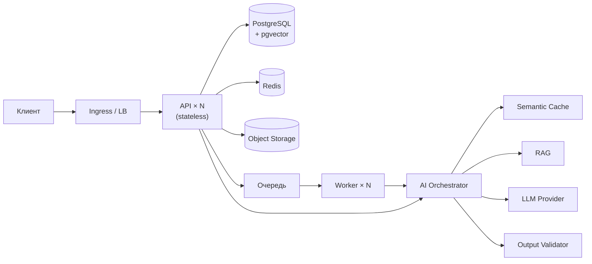

# hack-9013145c-opentowork

> **ШАБЛОН.** Разделы, помеченные `<!-- ЗАПОЛНИТЬ -->`, заполняются 23.09.2026 после
> объявления кейса. Остальное готово и менять не нужно.
> Требования к содержанию README — п. 5.4.15 Положения; если эксперт не сможет
> поднять проект по этой инструкции, команда не допускается до дальнейшего отбора (п. 5.4.16).

## Описание решения

<!-- ЗАПОЛНИТЬ: 3–5 предложений. Какую задачу кейса решаем, для кого, какую пользу даём. -->

**Задача хакатона:** <!-- ЗАПОЛНИТЬ: название Задачи -->
**Команда:** OpenToWork

## Быстрый старт

```bash
git clone <repo-url> && cd hack-9013145c-opentowork
cp .env.example .env
docker compose up -d
```

Или через `make`: `make up` (поднимет и дождётся готовности), `make help` — все команды.

Готово через ~60 секунд:

| Что | Где |
|---|---|
| API + Swagger | http://localhost:8000/docs |
| Health check | http://localhost:8000/health |
| Readiness (проверка зависимостей) | http://localhost:8000/ready |
| Метрики Prometheus | http://localhost:8000/metrics |
| Frontend (веб-интерфейс) | http://localhost:3000 |
| MinIO консоль | http://localhost:9001 (`minioadmin` / `minioadmin`) |

Мониторинг (опционально):
```bash
docker compose --profile observability up -d   # Prometheus :9090, Grafana :3001 (admin/admin)
```
Grafana открывается сразу на готовом дашборде «HackAlem AI — экономика и качество»:
доля ответов из кэша, экономия в долларах, задержка по стадиям, отказы валидации,
пропускная способность воркеров. Источник данных и дашборд заводятся автоматически,
настраивать вручную ничего не нужно.

### Демо-доступ

Данные создаются автоматически при старте (`SEED_ON_START=true`), внешние аккаунты
не нужны:

```
email:    demo@demo.kz
password: demo1234
```

По умолчанию `LLM_MODE=mock` — приложение полностью работает **без интернета и без
API-ключей**. Для запуска с реальной моделью: `LLM_MODE=live` + `LLM_API_KEY=...` в `.env`.

## Проверка основного сценария

### Автоматически (одна команда)

```bash
python3 scripts/smoke_test.py
```

Скрипт проходит весь путь и печатает результат по пунктам: health/ready → вход под
демо-учёткой → отклонение запроса без токена → поиск по базе знаний → AI-ответ →
**попадание в семантический кэш** → блокировка prompt injection → оценка ответа →
сводка экономики → асинхронная задача через воркер → метрики. Зависимостей не
требует, только stdlib.

Ожидаемый вывод:
```
  [PASS] Повтор попал в кэш — source=exact_cache за 25 мс (было 171 мс)
  [PASS] Перефразированный вопрос попал в семантический кэш — source=semantic_cache similarity=0.5987
  [PASS] Статистика считает попадания в кэш — hit_rate=0.6667 экономия=$0.005
  [PASS] Воркер обработал задачу — status=COMPLETED
  Все проверки пройдены — проект готов к сдаче.
```

### Вручную

<!-- ЗАПОЛНИТЬ под кейс. Пример структуры: -->

Через веб-интерфейс (основной путь для проверяющего):
1. Открыть http://localhost:3000 — логин и пароль уже подставлены, нажать «Войти».
2. Вкладка **Запрос**: задать вопрос, нажать «Спросить». Над ответом появится
   плашка `Ответ модели` с задержкой и числом использованных документов.
3. Переформулировать тот же вопрос своими словами и спросить ещё раз.
4. **Ожидаемый результат:** плашка становится `Семантический кэш`, показывает
   схожесть, во сколько раз быстрее и сколько денег сэкономлено — ответ отдан
   без обращения к модели.
5. Вкладка **База знаний**: видно, на каких документах строится ответ (RAG, а не
   обёртка над чатом). Вкладка **Метрики**: доля запросов, снятых кэшем, и экономика.

Через API (то же самое в Swagger):
1. Открыть http://localhost:8000/docs, авторизоваться через `POST /api/v1/auth/login`
   демо-учёткой, скопировать `access_token` в кнопку Authorize.
2. `POST /api/v1/ai/chat` с телом `{"query": "...", "context": {"language": "ru"}}`.
3. Повторить тот же запрос, переформулировав вопрос своими словами.
4. Ожидаемый результат: во втором ответе `meta.source` = `semantic_cache`,
   а `meta.latency_ms` падает на порядок. `GET /api/v1/ai/stats` покажет долю
   запросов, снятых кэшем, и оценку сэкономленных денег.

## Архитектура

Модульный монолит + асинхронные воркеры + AI-слой с семантическим кэшем и валидацией
выхода LLM. Stateless API, горизонтальное масштабирование, готовые манифесты Kubernetes.



**Заблудились в проекте? Начните с [`context/`](context/README.md)** — карта файлов,
список фич, рецепты «как сделать X» и разбор поломок.

Архитектурные обоснования — в [`docs/`](docs/00-index.md):

| Документ | О чём |
|---|---|
| [01 Архитектура](docs/01-architecture-overview.md) | принципы, модули, схема |
| [02 AI/LLM](docs/02-ai-llm-pipeline.md) | оркестратор, semantic cache, RAG, валидация и guardrails |
| [03 Данные](docs/03-database-schema.md) | ER-схема, pgvector, job lifecycle |
| [04 API](docs/04-api-specification.md) | эндпоинты, ошибки, идемпотентность |
| [05 Деплой](docs/05-deployment-and-kubernetes.md) | Docker, K8s, HPA, CI/CD |
| [06 Безопасность](docs/06-security-observability.md) | auth, RBAC, rate limit, логи, метрики |
| [07 План](docs/07-hackathon-execution-plan.md) | план работ и чек-листы команды |

## Технологии

| Слой | Выбор |
|---|---|
| Backend | Python 3.12, FastAPI, Pydantic v2, SQLAlchemy 2, Alembic |
| Frontend | React 18, TypeScript, Vite, nginx (проксирует `/api` на бэкенд) |
| БД | PostgreSQL 16 + pgvector (векторный поиск и semantic cache) |
| Кэш / очередь | Redis 7 (exact cache, rate limit, Redis Streams) |
| Хранилище | S3-совместимое (MinIO локально) |
| AI | Абстракция `LLMProvider` (Anthropic / OpenAI / локальные / mock), эмбеддинги, RAG |
| Инфраструктура | Docker, docker-compose, Kubernetes (Deployment, HPA, Ingress), GitHub Actions |
| Наблюдаемость | structlog (JSON), Prometheus, Grafana |

## Развёртывание в Kubernetes

```bash
kubectl apply -k infra/k8s/          # боевой кластер
kubectl apply -k infra/k8s-local/    # локальный кластер: mock-режим, 1 реплика
kubectl -n hackalem rollout status deploy/api
```

Включает: API с liveness/readiness/startup-пробами, воркеры, фронтенд, миграции
отдельной задачей, PostgreSQL + pgvector, Redis, MinIO, HPA (API 2→10,
воркеры 1→20), Ingress с TLS, PodDisruptionBudget, rolling update без простоя.

**Что проверено запуском, а что нет** — честно расписано в
[context/06-kubernetes.md](context/06-kubernetes.md). Коротко: локальный оверлей
`infra/k8s-local/` развёрнут на живом кластере, `smoke_test.py` прошёл 15 из 15
проверок против него, HPA отмасштабировал API 2→4 реплики за 30 секунд.
Базовый набор `infra/k8s/` собирается и валидируется API-сервером
(`kubectl apply --dry-run=server`), но в боевом кластере не разворачивался:
для него нужны свой registry, домен и секреты.
Обоснование решений — [docs/05](docs/05-deployment-and-kubernetes.md).

## Переменные окружения

Полный список с комментариями — [`.env.example`](.env.example). Ключевые:

| Переменная | Назначение | По умолчанию |
|---|---|---|
| `DATABASE_URL` | подключение к PostgreSQL | из docker-compose |
| `REDIS_URL` | подключение к Redis | из docker-compose |
| `LLM_MODE` | `live` — реальный провайдер, `mock` — работа без ключей | `mock` |
| `LLM_API_KEY` | ключ провайдера (только для `live`) | — |
| `SEMANTIC_CACHE_THRESHOLD` | порог косинусной близости для попадания в кэш | `0.92` |
| `SEMANTIC_CACHE_TTL` | время жизни записи кэша, сек | `86400` |
| `CACHE_CONTEXT_FIELDS` | поля контекста, различающие запросы | `language,region` |
| `RAG_TOP_K` | сколько документов подаётся в промпт | `5` |
| `RATE_LIMIT_AI` | лимит AI-запросов в минуту на пользователя | `20` |
| `RATE_LIMIT_LOGIN` | попыток входа в минуту на один email | `10` |
| `SEMANTIC_CACHE_SCOPE` | `global` — общий кэш; `user` — ключ включает владельца запроса | `global` |
| `SEMANTIC_CACHE_MAX_ROWS` | сверх этого воркер вытесняет самые холодные записи | `50000` |
| `JWT_SECRET` | подпись токенов (**обязательно сменить в проде**) | — |

## Разработка

Бэкенд:
```bash
uv sync                                   # зависимости
docker compose up -d postgres redis minio # только инфраструктура
uv run alembic upgrade head               # миграции
uv run uvicorn app.main:app --reload      # API с автоперезагрузкой
uv run pytest -q                          # тесты
uv run ruff check .                       # линтер
```

Фронтенд:
```bash
cd frontend && npm install
npm run dev                               # http://localhost:5173, /api проксируется на :8000
```

На Windows без локального Python-окружения тесты и линтер удобнее гонять в контейнере:
```bash
make test-docker
```

## Сторонние компоненты и лицензии

Раскрытие по п. 5.4.4 Положения.

| Компонент | Лицензия | Как используется |
|---|---|---|
| FastAPI | MIT | HTTP-слой |
| SQLAlchemy, Alembic | MIT | ORM и миграции |
| pgvector | PostgreSQL License | векторный поиск |
| Redis | RSALv2/SSPL (образ), клиент MIT | кэш, очередь |
| MinIO | AGPLv3 (только локальная среда разработки) | S3-совместимое хранилище |
| Prometheus, Grafana | Apache 2.0 / AGPLv3 | мониторинг |
| React, React DOM | MIT | веб-интерфейс |
| Vite, TypeScript | MIT / Apache 2.0 | сборка фронтенда |
| nginx | BSD-2-Clause | раздача статики и прокси `/api` |
| <!-- ЗАПОЛНИТЬ: модели, датасеты, готовые компоненты кейса --> | | |

Вся основная функциональность решения разработана в течение соревновательной части
23.09.2026. Инфраструктурный каркас и шаблоны подготовлены заранее в соответствии
с п. 5.4.4.2 Положения.

## Команда

| Участник | Роль |
|---|---|
| <!-- ЗАПОЛНИТЬ --> | |
