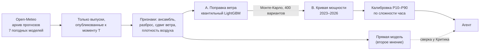
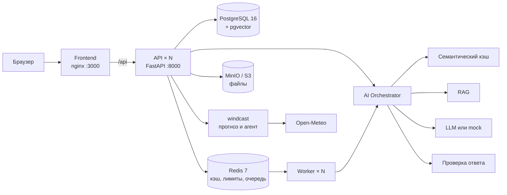

# Renewable Twin — прогноз выработки ветроэлектростанции

Команда **OpenToWork** · трек «Энергетика» · задача «Agentic AI для прогнозирования выработки ВЭС».

Система строит почасовой прогноз выработки ВЭС на 48 часов вперёд из любого момента
с интервалом неопределённости P10–P90. Агент сам берёт архивные прогнозы 7 мировых
погодных моделей — только те выпуски, что уже были опубликованы к моменту прогноза, —
проверяет их, запускает ML-модель, объясняет результат, пересчитывает прогноз при
выходе новой погоды и собирает черновик заявки на продажу в РФЦ.

На годовом бэктесте (365 прогнозов) почасовая точность — **84.2%** от номинала,
по суточной выработке — **91.2%**. Ошибка на 8% ниже, чем у текущей практики
«прогноз погоды + кривая мощности» (зимой — на 17–19%), выигрыш статистически значим.

**Демо-стенд:** http://89.126.192.240:3000 (API: http://89.126.192.240:8000/docs) ·
вход `demo@demo.kz` / `demo1234`

## Содержание

- [Что умеет](#что-умеет)
- [Быстрый запуск](#быстрый-запуск)
- [Как проверить](#как-проверить)
- [ML-часть: как мы прогнозируем выработку ВЭС](#ml-часть-как-мы-прогнозируем-выработку-вэс)
- [Черновик заявки в РФЦ](#черновик-заявки-в-рфц)
- [Архитектура](#архитектура)
- [Масштабируемость](#масштабируемость)
- [Надёжность и безопасность](#надёжность-и-безопасность)
- [Сильные стороны](#сильные-стороны)
- [План развития](#план-развития)
- [Для разработчика](#для-разработчика)
- [Сторонние компоненты и лицензии](#сторонние-компоненты-и-лицензии)

## Что умеет

| Раздел | Что делает | Нужен интернет |
|---|---|---|
| **Прогноз ВЭС Нурлы** | почасовой прогноз на 24/48 ч с P10–P90 по двум турбинам, 3D-сцена станции, история из SCADA, what-if «ветер на N% сильнее/слабее» | нет — прогнозы тестового периода 31.01–27.02.2026 лежат в репозитории |
| **Живой прогноз «Сейчас»** | прогноз Нурлы из текущего часа по свежей погоде; «Обновить» пересчитывает от текущего часа | да, Open-Meteo |
| **Почему прогноз такой** | разбор по шагам каскада, вклады факторов (TreeSHAP), причины каждой ревизии | нет для тестового периода |
| **Точность прогноза** | бэктест 02.2025–01.2026 в сравнении с базовыми подходами | нет |
| **Агент и Copilot** | шаги агента, происхождение прогноза, ответы на вопросы о прогнозе со ссылкой на выпуск | нет (режим `mock`) |
| **Черновик заявки в РФЦ** | суточная заявка на продажу и корректировки, выгрузка PDF/DOCX/CSV/JSON | нет |
| **Прогнозы по всем ВЭС** | 36 ВЭС Казахстана на карте: у Нурлы — выработка по ML-модели, у остальных — номинал, ветер и штормовые предупреждения (истории их турбин нет, выработку не выдумываем) | да |
| **Новая турбина** | выработка виртуальной турбины в любой точке по текущей погоде | да |
| **Солнечные станции** | 26 СЭС Казахстана из OpenStreetMap, прогноз по радиации | да |
| **Панели на крышах** | Астана, Алматы, Шымкент: сколько панелей поместится, выработка за год с учётом теней | расчёт — нет; подложка карты — да |
| **AI-платформа** | чат с RAG, семантический кэш, проверка ответов LLM, фоновые задачи, метрики | нет (режим `mock`) |

## Быстрый запуск

Подробная инструкция для человека, который видит проект впервые, — [RUN.md](RUN.md).

Нужен Docker с Compose v2 и свободные порты `3000`, `8000`, `5432`, `6379`, `9000`, `9001`.
API-ключи и внешние аккаунты не нужны.

```bash
git clone https://github.com/BAITC-Hacks/hack-9013145c-opentowork.git
cd hack-9013145c-opentowork
cp .env.example .env              # Windows: copy .env.example .env
docker compose up -d --build
```

Первая сборка занимает несколько минут: Docker ещё и обучает ML-модель (около 2 минут).
Стек готов, когда `docker compose ps` показывает `healthy` у `api`, `frontend` и `worker`.

| Что | Адрес |
|---|---|
| Веб-интерфейс | http://localhost:3000 (`demo@demo.kz` / `demo1234`) |
| API и Swagger | http://localhost:8000/docs |
| Health / готовность | http://localhost:8000/health, http://localhost:8000/ready |
| Метрики Prometheus | http://localhost:8000/metrics |

Демо-пользователь и данные создаются при первом старте. По умолчанию `LLM_MODE=mock`:
всё работает без интернета и ключей. Настоящая LLM — `LLM_MODE=live` и `LLM_API_KEY` в `.env`.

Мониторинг: `docker compose --profile observability up -d` → Grafana http://localhost:3001
(`admin` / `admin`) с готовым дашбордом. Сброс: `docker compose down -v`.

## Как проверить

### Автоматически

```bash
python3 scripts/smoke_test.py      # нужен только Python 3, без пакетов
```

Скрипт проходит основной путь и печатает `PASS`/`FAIL` по каждой проверке: вход и отказ
без токена, AI-ответ и попадание в кэш, блокировка prompt injection, фоновая задача,
метрики, прогноз ВЭС (48 согласованных квантилей, горизонт 24 ч, what-if, Copilot,
история SCADA, отсутствие выдуманного факта за февраль).

### В интерфейсе

1. http://localhost:3000 → вход демо-пользователем.
2. **Ветровая энергия** → **ВЭС Нурлы** (или http://localhost:3000/#/forecast/wind/nurly).
3. **«Дата прогноза»** → 07.02.2026: график с коридором P10–P90 и 3D-сцена станции.
   Пункт **«Сейчас · живой прогноз»** — прогноз из текущего часа (нужен интернет).
4. Переключите **24 ч / 48 ч**; нажмите на турбину — её история из SCADA
   (за февраль 2026 измерений нет, и интерфейс так и показывает).
5. **«Что если»** — пересчёт того же выпуска при другом ветре.
6. **«Объяснить прогноз →»** под графиком — разбор по шагам, вклады факторов, причины ревизий.
7. **«Точность прогноза»** — бэктест в сравнении с базовыми подходами.
8. **«Как считается»** — шаги агента и **AI Copilot**: «Когда ожидается пик выработки?»,
   «Что будет, если ветер окажется на 15% слабее?». В ответе — ID выпуска и выполненные расчёты.
9. **«Заявка РФЦ»** — черновик заявки на сутки, корректировки, скачивание PDF/DOCX/CSV/JSON.
10. **Прогнозы** в верхнем меню — все ВЭС на текущей погоде.
11. **Панели на крышах** — город и здание: число панелей, выработка, тени.
12. **«Платформа и инструменты»** внизу — задайте вопрос, затем его же другими словами:
    второй ответ придёт из семантического кэша, задержка упадёт на порядок.

### Через API

Сохранённые прогнозы, метрики и заявки открыты без токена:

```bash
curl "http://localhost:8000/api/v1/forecast/latest?origin=2026-02-07"   # P10/P50/P90, шаги агента, ревизии
curl "http://localhost:8000/api/v1/forecast/latest?origin=2025-12-15"   # прогноз бэктеста вместе с фактом
curl http://localhost:8000/api/v1/metrics                               # метрики бэктеста
curl -o zayavka.pdf "http://localhost:8000/api/v1/bids/2026-02-07/file?format=pdf"
```

Живые расчёты, объяснение и AI требуют токен:

```bash
TOKEN=$(curl -s -X POST http://localhost:8000/api/v1/auth/login \
  -H "Content-Type: application/json" \
  -d '{"email":"demo@demo.kz","password":"demo1234"}' | python3 -c "import json,sys;print(json.load(sys.stdin)['access_token'])")

curl -H "Authorization: Bearer $TOKEN" "http://localhost:8000/api/v1/explain?origin=2026-02-07"
curl -H "Authorization: Bearer $TOKEN" "http://localhost:8000/api/v1/predictions/run?station_id=nurly&origin=now"
curl -X POST http://localhost:8000/api/v1/ai/chat \
  -H "Authorization: Bearer $TOKEN" -H "Content-Type: application/json" \
  -d '{"query": "Как рассчитывается прогноз?", "context": {"language": "ru"}}'
```

Повторите вопрос к чату другими словами: `meta.source` станет `semantic_cache`, а
`meta.latency_ms` заметно уменьшится. Все эндпоинты — в Swagger.

## ML-часть: как мы прогнозируем выработку ВЭС

### Коротко

Система строит почасовой прогноз выработки ВЭС на 48 часов вперёд из любого момента,
по самой свежей погоде, доступной на этот момент. Прогноз даёт не только ожидаемую
мощность, но и интервал неопределённости P10–P90 — диапазон, в который реальная выработка
попадает в 80% случаев. Прогноз строится на архивных прогнозах семи мировых погодных
моделей и ML-модели, обученной на истории турбин. Агент проверяет результат, объясняет
его и сам пересчитывает прогноз, когда выходит новый выпуск погоды (каждые 6 часов).

- Для заявки в РФЦ берётся последний прогноз до срока подачи — 08:00 по Астане накануне
  операционных суток.
- В бэктесте и тестовом периоде прогноз выпускается ежедневно в 00:00 UTC, чтобы
  результаты были сопоставимы и воспроизводимы.

### Главная идея: учимся на прогнозах погоды, а не на фактической погоде

**Как проще, но неправильно.** В данных турбин есть фактический ветер, и он почти идеально
связан с мощностью: корреляция 0.95. Модель «ветер → мощность» на таких данных очень точна
на обучении. Но в момент прогноза завтрашнего фактического ветра ещё нет — есть только
прогноз погоды, а он ошибается. Модель, обученная на идеальном ветре, ничего не знает
об этих ошибках, и на реальном прогнозе её точность резко падает. Мы это измерили:

| Что с чем сравниваем | Корреляция |
|---|---|
| Фактический ветер у турбины ↔ мощность | 0.95 |
| Прогноз погоды за сутки ↔ фактический ветер | 0.78 |
| Прогноз погоды за двое суток ↔ фактический ветер | 0.74 |
| Прогноз погоды за трое суток ↔ фактический ветер | 0.68 |

Реальная отправная точка — не 0.95, а 0.68–0.78.

**Как сделали мы.** Для обучения берём не фактическую погоду, а архивные прогнозы погоды —
то, что метеоцентры предсказывали заранее. Источник — Open-Meteo Previous Runs API: для
каждого часа он хранит значения, предсказанные за 1, 2, 3 суток до него. Модель видит на
обучении ровно то же, что увидит в работе, и учится исправлять типичные ошибки погодных
моделей именно на этой площадке. Например, она выучила, что зимой прогноз здесь завышает
ветер в среднем на 0.45 м/с.

**Защита от «подглядывания в будущее».** Выпуск погоды публикуется с задержкой в несколько
часов, поэтому для горизонта `h` берётся только выпуск, гарантированно опубликованный
к моменту прогноза:

```
N(h) = ⌈(h + 6) / 24⌉   — за сколько суток до нужного часа выпущен прогноз
```

Правило живёт в одной функции ([windcast/weather.py](windcast/weather.py)) и считается от
момента запроса, поэтому одинаково работает в бэктесте и в живом режиме. Это требование
кейса, и оно проверено тестом, а не обещанием:
[test_windcast_leakage.py](tests/test_windcast_leakage.py) подменяет мусором все данные
погоды, опубликованные позже момента прогноза, и проверяет, что признаки модели не
изменились ни на бит. Живой API тоже не даёт финальной модели считать прогноз из момента
раньше границы её обучения (31.01.2026): такие даты отдаются только из walk-forward-бэктеста.

### Данные

- **Турбины:** две турбины, 10-минутные записи с марта 2023 по январь 2026: ветер, мощность,
  температура. Приводим к часовому шагу, местное время (UTC+5) переводим в UTC.
- **Простои:** часы простоя и ограничений (сильный ветер при нулевой мощности, выработка
  ниже кривой на 30% номинала) помечаются и исключаются из обучения. Модель прогнозирует
  мощность, которую станция может выдать при такой погоде.
- **Погода:** 7 моделей — ECMWF IFS, ECMWF AIFS (погодная модель на нейросети), ICON, GFS,
  UKMO, GEM, CMA. Ветер на 10/80/100/120 м, направление, порывы, температура, влажность,
  давление. Архив лежит в репозитории, поэтому всё воспроизводится без интернета.

### Как устроена модель



**1. Признаки.** Главный — ансамбль погодных моделей: среднее по моделям точнее лучшей
одиночной (корреляция с фактом 0.78 против 0.74 у ECMWF AIFS). К нему добавляются разброс
между моделями (мера неопределённости), направление ветра, сдвиг ветра по высоте (признак
ночной инверсии), плотность воздуха, риск обледенения, время суток и сезон.

**2. Каскад — итоговая модель.** Два понятных шага:
- **A. Поправка ветра:** LightGBM переводит прогноз погоды в реальный ветер у турбины.
  На выходе не одно число, а распределение (7 квантилей).
- **B. Кривая мощности:** «ветер → мощность», обучена на всей истории турбин (~50 тыс. часов).
  Монотонна по ветру — мощность физически не может падать с ростом ветра до номинала.
  Учитывает температуру: зимой плотный воздух даёт больше мощности при том же ветре.
- **Связка — Монте-Карло:** 400 вариантов ветра из шага A прогоняются через кривую B. Так
  получается честное распределение мощности с правильным учётом нелинейности кривой.

**3. Калибровка интервалов.** Интервалы доводятся до честного покрытия конформной
калибровкой (CQR), отдельно для каждого режима: по давности выпуска погоды (1, 2 или 3 суток)
и по сложности часа (ширине интервала до калибровки). Поправки подбираются только на
прогнозах прошлых месяцев, поэтому интервал честный в каждом режиме, а не только в среднем.

**4. Прямая модель — второе мнение.** LightGBM переводит погоду сразу в мощность. Раньше итог
был смесью каскада и прямой модели, но проверка показала, что смесь не даёт выигрыша ни по
точности (MAE 0.1566 против 0.1566), ни по интервалам: обе модели учатся на одних признаках
и ошибаются одинаково. Итог упрощён до каскада, а прямая модель работает у Критика: если две
по-разному устроенные модели сильно расходятся, час помечается для проверки.

**5. Агент** ([windcast/agent/](windcast/agent/)) — граф с явными проверками между шагами:

> Планировщик → Сборщик погоды → Контроль качества → Прогнозист → Критик → Аналитик → Объяснитель → Ревизор → Отчёт

| Шаг | Что делает |
|---|---|
| Планировщик | определяет самый свежий выпуск погоды на момент запуска (интерфейс, API или CLI) |
| Сборщик погоды | собирает прогнозы доступных погодных моделей |
| Контроль качества | проверяет погоду до расчёта; нет данных — откат на предыдущий выпуск; непроверенная погода в расчёт не идёт |
| Прогнозист | запускает каскад и калибровку; часы без погоды закрывает климатологией с флагом `degraded` |
| Критик | ловит пересечение квантилей, выход за номинал, пропуски часов, расхождение с прямой моделью; при сбое — запасной прогноз, тоже перепроверенный |
| Аналитик | ищет резкие перепады выработки (≥ 30% номинала за 3 ч) и риск обледенения |
| Объяснитель | раскладывает прогноз на причины (см. ниже) |
| Ревизор | при новом выпуске погоды (00/06/12/18 UTC) пересчитывает и публикует версию, только если она заметно отличается |
| Отчёт | сводка оператору: шаблоном или через LLM; каждое число в тексте LLM сверяется с расчётом |

### Модель не чёрный ящик

Для каждого часа можно ответить на три вопроса: как получилось число, почему модель так
решила и почему прогноз изменился. Кнопка **«Объяснить прогноз»** под графиком открывает
страницу, где всё это видно (API: `GET /api/v1/explain`, `GET /api/v1/explain/global`).

**1. Как получилось число — разбор по шагам.** Пример: 07.02, 11:00 по Астане.

| Шаг | Ветер | Мощность, % номинала |
|---|---|---|
| Сырой прогноз погоды (среднее 4 моделей) → кривая мощности | 5.66 м/с | 18.7% |
| Модель поправила ветер под площадку → кривая | 4.83 м/с | 10.7% |
| Учли неопределённость ветра (Монте-Карло) → итог | — | 9.8% |
| Калибровка интервала под сложность часа | — | P10–P90: 0–60% |

В этот час погодные модели сильно расходились: ECMWF IFS обещал 2.5 м/с, GFS — 11.4 м/с.
Модель знает, какие из них точнее на этой площадке, поэтому снизила прогноз, а интервал
сделала широким: час сложный.

**2. Почему модель так решила — вклад факторов.** Вклады считаются методом SHAP, встроенным
в LightGBM: для деревьев решений он точный и аддитивный — базовое значение плюс сумма
вкладов равно прогнозу (проверено тестом). Около 50 признаков сведены в 10 понятных групп.
Для того же часа: типичная поправка — 6.31 м/с, итог — 4.83 м/с. Разница складывается так:

| Фактор | Вклад в ветер | В мощности |
|---|---|---|
| Тенденция ветра (последние часы ветер слабел) | −0.92 м/с | −7.1 п.п. |
| Уровень прогноза ветра | −0.57 м/с | −4.4 п.п. |
| Температура, влажность, давление | +0.34 м/с | +2.7 п.п. |
| Время суток | −0.32 м/с | −2.5 п.п. |

**3. Почему прогноз изменился.** Для каждой новой версии агент объясняет сдвиг. Например,
выпуск погоды в 06 UTC 06.02 изменил прогноз на 07.02 04:00 с 49% до 22% номинала: ECMWF IFS
снизил ветер на 2.9 м/с, ECMWF AIFS — на 1.4 м/с, среди факторов сильнее всего изменилась
тенденция ветра. То же обоснование попадает в черновик корректировки заявки в РФЦ.

**4. Свойства модели в целом:** выученная кривая мощности зимой и летом; на что модель
опирается (уровень и тенденция прогноза ветра — около 70% вклада); точность каждой
погодной модели на площадке; честность интервалов.

Все объяснения считаются кодом из самой модели, без LLM. LLM, если подключена, только
пересказывает готовые факты, и каждое число в её тексте сверяется с ними.

### Результаты

Бэктест повторяет условия тестового периода: каждый месяц с 02.2025 по 01.2026 модель
переобучается только на прошлом, прогноз выпускается ежедневно в 00:00 UTC на 48 часов.
Итого 365 прогнозов, две турбины. Ошибка — в долях номинала, по всем часам с фактом,
включая простои.

| Модель | MAE | Точность (1 − MAE) | Покрытие P10–P90 | Покрытие P5–P95 |
|---|---|---|---|---|
| **Итоговая: каскад + калибровка** | **0.158** | **84.2%** | **80.9%** (цель 80%) | **90.2%** (цель 90%) |
| Прямая модель (второе мнение) | 0.161 | 83.9% | 66.6% | 81.4% |
| Прогноз погоды + кривая мощности (как делают станции сейчас) | 0.172 | 82.8% | — | — |
| Климатология (средняя мощность по месяцу и часу) | 0.310 | 69.0% | — | — |
| «Как вчера» | 0.363 | 63.7% | — | — |

**Точность:**
- по суточной выработке — **91.2%** (у текущей практики 90.1%);
- для операционных суток заявки (часы 19–43 прогноза, уровень станции) — **84.1%**.
  Для сравнения: Самрук-Энерго ставит цель «точность 80%» к концу 2026 года; их определение
  точности не опубликовано, поэтому сравнение ориентировочное;
- против «как вчера» ошибка на 56% меньше;
- против текущей практики — на 8% меньше в среднем за год, зимой на 17–19%
  (январь 2026: 0.151 против 0.187; февраль 2025: 0.178 против 0.216);
- чем старше выпуск погоды, тем больше ошибка: MAE 0.148 / 0.161 / 0.180 для выпусков
  за 1 / 2 / 3 суток.

**Выигрыш не случайный.** Тест Diebold–Mariano на 365 сутках с поправкой на перекрытие
прогнозов соседних дней: против прогноза погоды с кривой мощности p = 5·10⁻¹², против
«как вчера» p < 10⁻¹⁵.

**Интервалы честные и адаптивные.** Средняя ширина P10–P90 — 47 п.п. номинала, но это смесь
очень разных часов. Интервал узкий там, где погода предсказуема, и широкий там, где нет,
а покрытие остаётся близким к 80% в каждом режиме:

| Часы (по предсказанной сложности) | Ширина P10–P90 | Покрытие |
|---|---|---|
| Самые предсказуемые 25% | 14 п.п. | 80.4% |
| Ниже среднего | 36 п.п. | 82.0% |
| Выше среднего | 59 п.п. | 82.2% |
| Самые сложные 25% | 80 п.п. | 83.2% |

- Интервал климатологии при том же покрытии — 94 п.п.: наш вдвое уже, а общая оценка
  вероятностного прогноза (CRPS) лучше почти на 40%.
- Широкие интервалы — это часы, где ветер попадает на крутой участок кривой мощности
  (7–11 м/с) или погодные модели расходятся. Там неопределённость реальная, и интервал
  обязан её показать.
- На уровне станции (куда идёт заявка) покрытие 82.2%: интервал немного консервативный.

**Пересчёты агента в течение суток** (январь 2026, одни и те же часы):

| Выпуск | Точность относительно утреннего | Ширина P10–P90 |
|---|---|---|
| 00 UTC (утро) | — | 49 п.п. |
| 06 UTC | −2.2% | 48 п.п. |
| 12 UTC | +1.1% | 48 п.п. |
| 18 UTC | +1.6% | 46 п.п. |

К вечеру прогноз становится точнее и увереннее. Выигрыш пока небольшой: архив погоды хранит
прогнозы с шагом в сутки, поэтому пересчёт в течение дня получает свежие данные только для
части часов. Поэтому Ревизор публикует новую версию, только если прогноз заметно сдвинулся,
и мелкие колебания не превращаются в лишние корректировки заявки.

### Где модель даёт больше всего

- **Зимой**, когда ошибки прогноза стоят дороже всего: ошибка ниже текущей практики на
  17–19%. Зимой прогноз погоды на этой площадке систематически завышает ветер (в среднем на
  0.45 м/с), и модель выучивает и снимает эту ошибку.
- **Летом** точность держится на уровне лучших метеопрогнозов. Летний ветер здесь больше
  зависит от локальных процессов (дневной прогрев, горно-долинная циркуляция), которые
  глобальные модели описывают хуже: корреляция прогноза с фактом летом 0.64 против 0.80 зимой.
  Систематической ошибки, которую можно выучить, летом почти нет — резерв здесь в более
  детальных погодных данных (см. [План развития](#план-развития)).

### Как воспроизвести

ML-часть — пакет [`windcast/`](windcast/), запускается без веб-стека (Python 3.12+).
Архив погоды уже в `artifacts/weather/`, сеть не нужна.

```bash
python -m venv .venv && source .venv/bin/activate     # Windows: .venv\Scripts\activate
pip install -e ".[dev,ml]"

python -m windcast backtest               # бэктест 02.2025–01.2026, 365 выпусков (~6 мин)
python -m windcast train                  # итоговая модель на данных до 31.01.2026 00:00 UTC
python -m windcast test-period            # прогноз на тестовый период 31.01–27.02.2026 (~3 мин)
python -m windcast agent --origin 2026-02-07   # один день с выводом шагов агента
python -m windcast bids                   # черновики заявок в РФЦ на 01.02–28.02
pytest -q tests/test_windcast_*.py        # утечка будущего, агент, объяснения, API
```

**Главный результат:** [`artifacts/forecasts/test_period_forecast.csv`](artifacts/forecasts/test_period_forecast.csv) —
28 выпусков (31.01…27.02.2026, каждый в 00:00 UTC = 05:00 Астаны) × 48 часов, P10/P50/P90
в долях номинала. Все версии с пересчётами агента — `test_period_all_versions.csv`,
полный прогон за день — `artifacts/forecasts/<дата>.json`, метрики —
`artifacts/reports/backtest_summary.json`.

## Черновик заявки в РФЦ

Из прогноза агента собирается черновик **заявки на продажу** по форме приложения 7 Правил
организации и функционирования оптового рынка электрической энергии (приказ Минэнерго РК,
V1500010531): получатель — единый закупщик (РФЦ), операция «Продажа», 24 часовых объёма в МВт.

- **Срок подачи** — до 08:00 по Астане накануне суток поставки. В заявку идёт выпуск 00 UTC
  (05:00 Астаны), горизонты 19–43 ч.
- **Корректировки** — пересчёты агента в 06, 12 и 18 UTC становятся черновиками корректировок,
  если прогноз сдвинулся не меньше чем на 10% установленной мощности, с обоснованием из
  раздела «Почему прогноз изменился».
- Все объёмы считает код, LLM к заявке не допускается. Допущения напечатаны в документе.

Файлы: `artifacts/bids/<дата>/zayavka_<дата>.{pdf,docx,csv,json}`, в интерфейсе — вкладка
**«Заявка РФЦ»**, через API — `GET /api/v1/bids/2026-02-07/file?format=pdf`.

## Архитектура

Модульный монолит на FastAPI, фоновые воркеры, ML-контур `windcast` и AI-слой
с семантическим кэшем и проверкой ответов LLM.



Путь AI-запроса: проверка ввода (prompt injection, персональные данные, длина) → точный кэш
в Redis → эмбеддинг → семантический кэш в pgvector → поиск по базе знаний → LLM → проверка
ответа по схеме и источникам с повтором → запасной ответ при неудаче → запись в кэш.

Фронтенд (React + TypeScript, 3D на Three.js, карты на MapLibre) ходит к API по
относительному `/api` через nginx — ни CORS, ни зашитого адреса.

| Путь | Что там |
|---|---|
| `app/` | бэкенд: API (`app/api/v1/`), AI-слой (`app/ai/`), кэш, RAG, воркеры, крыши (`app/solar/`), новые турбины (`app/wind/`) |
| `windcast/` | ML-модель и агент прогноза ВЭС, CLI `python -m windcast` |
| `frontend/` | веб-интерфейс |
| `datasets/` | данные турбин от организатора (03.2023–01.2026) |
| `artifacts/` | архив погоды, модели, прогнозы, отчёты бэктеста, заявки, объяснения |
| `infra/` | Dockerfile, Prometheus, Grafana, манифесты Kubernetes |
| `tests/`, `scripts/smoke_test.py` | тесты и сквозная проверка |
| `docs/`, `context/` | архитектурные решения и навигация по коду |

## Масштабируемость

**По нагрузке.**
- **API без состояния** — масштабируется репликами. Всё общее (лимиты запросов, кэш,
  очередь) лежит в Redis, поэтому лимит не умножается на число подов, а ответ из кэша
  доступен с любой реплики.
- **Воркеры масштабируются отдельно от API.** Очередь — Redis Streams с группой
  потребителей: задачу умершего воркера забирает другой, битые сообщения уходят в
  dead-letter, ключ идемпотентности защищает от двойной постановки, а захват задачи
  атомарный — два воркера не обработают её дважды.
- **Kubernetes:** автомасштабирование API 2→10 реплик, воркеров 1→20, пробы
  liveness/readiness/startup, миграции отдельной задачей, обновление без простоя,
  PodDisruptionBudget. Локальный вариант (`infra/k8s-local/`) развёрнут в кластере:
  smoke-тест прошёл, автомасштабирование подняло API с 2 до 4 реплик за 30 секунд.
- **Семантический кэш** отвечает на повтор и перефразированный вопрос без вызова LLM:
  меньше денег и задержки при росте числа пользователей. Экономию показывает `/ai/stats`
  и дашборд Grafana.
- **ML дёшев на чтении:** обучение идёт офлайн (CLI или при сборке образа), готовые прогнозы
  отдаются из артефактов. Живой пересчёт тяжелее, поэтому доступен только с токеном и
  ограничен 6 запусками в минуту на пользователя (`RATE_LIMIT_FORECAST_LIVE`).

**По станциям и регионам.**
- **Новая ВЭС** — нужны координаты и история выработки: погодный архив, признаки, обучение,
  бэктест и агент собираются теми же командами `windcast`. Обучение модели — около 2 минут.
- **Станции без истории** уже на карте: 36 ВЭС получают прогноз ветра и штормовые
  предупреждения по координатам.
- **Не только ветер:** тот же каркас уже считает 26 СЭС по радиации и солнечные крыши трёх
  городов; доменная логика подключается модулем, инфраструктура не меняется.

## Надёжность и безопасность

- **Деградация вместо падения.** Пропала погодная модель — ансамбль перевешивается на
  остальные; погоды нет совсем — часы закрываются климатологией с флагом `degraded`, и
  интерфейс честно показывает «—» вместо ветра; основной и запасной прогноз не прошли
  Критика — прогноз не публикуется.
- **Проверка ответов LLM** в четыре слоя: схема, опора на источники, выдуманные источники,
  выдуманные числа. Числа в заявке и объяснениях LLM не генерирует.
- **Изоляция пользователей:** JWT, роли, доступ к чужим объектам, задачам и документам
  закрыт и проверен интеграционными тестами; кэш по умолчанию свой у каждого пользователя.
- **Защита ввода:** prompt injection, персональные данные, лимит длины; лимиты частоты
  на вход, AI-запросы и живые расчёты.
- **Наблюдаемость:** структурные логи с `request_id`, метрики Prometheus, готовый дашборд
  Grafana (кэш, задержки по стадиям, отказы валидации, очередь).
- **CI:** на каждый пуш — линтер и юнит-тесты; на pull request — интеграционные тесты
  с PostgreSQL и Redis, поиск секретов, аудит зависимостей, сканирование образов.

## Сильные стороны

1. **Честная постановка.** Обучение на архивных прогнозах погоды и тест на утечку будущего:
   модель проверена в тех же условиях, в которых будет работать.
2. **Проверенный результат.** Бэктест на 365 прогнозах по протоколу теста, выигрыш над
   текущей практикой статистически значим.
3. **Прогноз по запросу.** Из любого момента, по самой свежей доступной погоде,
   с автоматическим пересчётом при каждом новом выпуске.
4. **Интервалы, которым можно верить.** Покрытие близко к обещанному в каждом режиме —
   диспетчер видит, в какие часы держать резерв.
5. **Ансамбль мировых погодных моделей**, включая нейросетевую ECMWF AIFS — лучшую одиночную
   модель на этой площадке по корреляции с фактом.
6. **Физика внутри ML.** Каскад отделяет ошибку погоды от физики турбины, кривая мощности
   монотонна, учитывается плотность воздуха.
7. **Простота.** Каждый компонент оправдан замером; то, что не давало выигрыша (смесь двух
   моделей), убрано из итога.
8. **Прозрачность.** Каждый час раскладывается на шаги и факторы, каждая ревизия объяснена.
9. **Устойчивость.** Сбой данных ведёт к помеченному деградированному прогнозу или к отказу
   публиковать, а не к тихой ошибке.
10. **Готовые документы.** Черновик заявки в РФЦ по форме Правил оптового рынка и черновики
    корректировок внутри суток — автоматически.
11. **Воспроизводимость.** Одна команда, без интернета и API-ключей; результаты бэктеста
    совпадают при перезапуске.
12. **Готовность к продакшену.** Независимое масштабирование API и воркеров, Kubernetes,
    мониторинг, CI, изоляция пользователей.

## План развития

| Направление | Сейчас | Дальше |
|---|---|---|
| Точность летом и ширина интервалов | глобальные погодные модели, выпуски с шагом в сутки | согласованность выпусков за 1–3 суток как признак (данные уже есть), сетка точек погоды вокруг станции, региональные модели с мелкой ячейкой, ансамбль ECMWF ENS, внутрисуточные выпуски |
| Выработка в МВт | номинал турбин в данных не указан: прогноз в долях номинала, в заявке — допущение 2.5 МВт | паспортные данные станции |
| Проверка на факте февраля 2026 | факта за тестовый период в кейсе нет; качество оценено бэктестом на тех же зимних месяцах прошлых лет | сверка с фактом при его получении |
| ML для других ВЭС | ML-прогноз — у Нурлы; у остальных станций ветер и предупреждения | подключение истории выработки → обучение той же командой |
| Подача заявки | черновик PDF/DOCX/CSV/JSON | интеграция с системой рынка и ЭЦП |
| Живые прогнозы под нагрузкой | пересчёт в API с лимитом; кэш погоды и живых прогнозов — в памяти процесса | вынести пересчёт в очередь воркеров, общий кэш в Redis, резервный источник погоды |
| Продакшен-кластер | базовые манифесты `infra/k8s/` проходят проверку API-сервером | развёртывание с registry, доменом и секретами заказчика |
| Солнечная энергетика | СЭС и крыши по физике, без факта выработки | калибровка на данных реальных СЭС |

## Для разработчика

```bash
pip install -e ".[dev,ml]"
docker compose up -d postgres redis minio && alembic upgrade head
uvicorn app.main:app --reload                 # API на :8000
cd frontend && npm install && npm run dev     # http://localhost:5173

pytest -q && ruff check .                     # юнит-тесты и линтер, база и сеть не нужны
make test-integration                         # проверки доступа, нужен поднятый стек
```

Для локального API в `.env` замените хосты `postgres`, `redis`, `minio` на `localhost`.
На Windows без Python: `make test-docker`. Все переменные окружения с комментариями —
в [`.env.example`](.env.example); при `APP_ENV=prod` приложение не стартует
с секретами по умолчанию. Kubernetes: `kubectl apply -k infra/k8s-local/`.
Подробности устройства — [docs/](docs/00-index.md) и [context/](context/README.md).

| Симптом | Что сделать |
|---|---|
| `port is already allocated` | освободите порт или поменяйте левую часть `ports:` в `docker-compose.yml` |
| `api` долго не становится `healthy` | первая сборка обучает модель; `docker compose logs -f api` |
| Не открываются «Прогнозы» или «Сейчас» | нужен интернет у контейнера `api` (Open-Meteo); тестовый период работает офлайн |
| Нет подложки карты городов | её грузит браузер из OpenFreeMap; расчёт крыш от неё не зависит |
| Нужна чистая установка | `docker compose down -v && docker compose up -d --build` |

## Сторонние компоненты и лицензии

| Компонент | Лицензия | Как используется |
|---|---|---|
| FastAPI, SQLAlchemy, Alembic | MIT | HTTP-слой, ORM, миграции |
| pgvector | PostgreSQL License | векторный поиск |
| Redis | RSALv2/SSPL (образ), клиент MIT | кэш, очередь |
| MinIO | AGPLv3 (только локальный стенд) | S3-совместимое хранилище |
| Prometheus, Grafana | Apache 2.0 / AGPLv3 | мониторинг |
| React, Vite, TypeScript | MIT / Apache 2.0 | веб-интерфейс |
| Three.js | MIT | 3D-сцены станции и крыш |
| MapLibre GL JS | BSD-3-Clause | карты городов |
| OpenFreeMap, Mapterhorn | данные OSM (ODbL) / рельеф с атрибуцией | подложка и рельеф карт |
| Inter (`@fontsource-variable/inter`) | SIL OFL 1.1 | шрифт интерфейса |
| nginx | BSD-2-Clause | раздача фронтенда и прокси `/api` |
| LightGBM | MIT | квантильные модели |
| NumPy, pandas, scikit-learn, PyArrow | BSD-3-Clause / Apache 2.0 | обработка данных |
| python-docx, ReportLab | MIT / BSD | заявка в DOCX и PDF |
| DejaVu Sans | свободная (Bitstream Vera / public domain) | кириллица в PDF |
| windpowerlib (oemof) | MIT, текст в `app/wind/UPSTREAM-LICENSE.txt` | кривые мощности новых турбин |
| Open-Meteo | данные CC BY 4.0 | архив прогнозов и текущая погода |
| ECMWF IFS/AIFS, DWD ICON, NOAA GFS, UKMO, GEM, CMA | через Open-Meteo, CC BY 4.0 | исходные погодные модели |
| OpenStreetMap | ODbL | здания городов, справочник ВЭС и СЭС |
| PVGIS-ERA5 (JRC, Еврокомиссия) | свободно со ссылкой на источник | радиация для крыш |
| Данные турбин 1 и 2 (03.2023–01.2026) | предоставлены организатором | обучение и бэктест |

Основная функциональность разработана 23.09.2026 во время хакатона. Инфраструктурный
каркас (API, кэш, очередь, авторизация, манифесты) подготовлен заранее.

**Команда OpenToWork**
