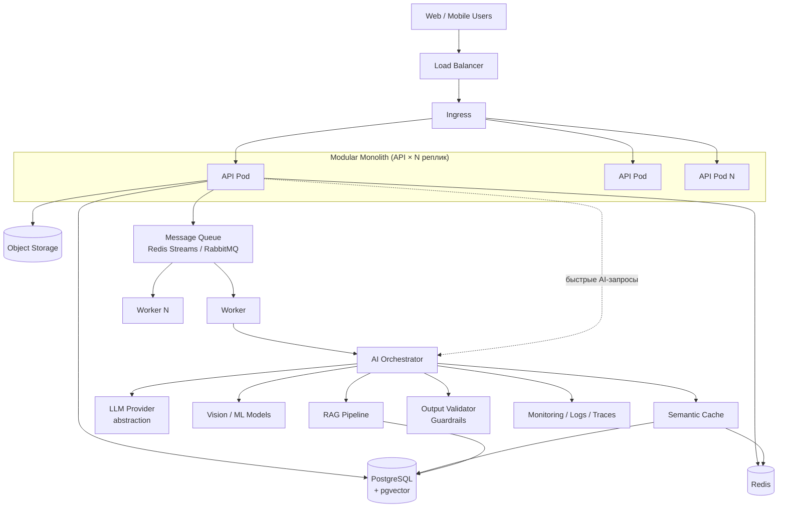

# 1. Архитектурный обзор

## 1.1 Задача

Платформа не привязана к предметной области: инфраструктура (API, авторизация, кэш,
очередь, AI-слой) одинакова для любой AI-задачи, а специфика вынесена отдельно —
правила проверки в `app/domain/`, прогноз ВЭС в пакет `windcast/`.

## 1.2 Принципы

### Модульный монолит, а не микросервисы
Один деплоюмый сервис с чёткими внутренними границами:

```
auth/            — аутентификация, JWT, роли
users/           — пользователи
domain/          — <<< СЮДА кейс-специфичная бизнес-логика (Farms/Crops → Orders/Patients/…)
ai/              — LLM-абстракция, оркестратор
rag/             — retrieval-augmented generation
cache/           — semantic + regular cache
files/           — object storage
notifications/   — уведомления
```

Микросервисы на этом этапе добавили бы сетевые интеграции и сложный деплой без
пользы для продукта. Модульный монолит даёт те же архитектурные плюсы — чёткие
границы модулей, возможность вынести модуль в отдельный сервис позже — без этой
операционной сложности.

### Stateless API
API-под не хранит важное состояние в памяти процесса. Состояние — в:
- PostgreSQL (данные)
- Redis (кэш, сессии, rate-limit, локи)
- Object Storage (файлы)
- pgvector (эмбеддинги)

Следствие: `API ×N` реплик можно поднимать/гасить не думая — это и есть
"масштабируемость" из критериев оценки, причём бесплатно, если сделать stateless с самого начала.

### Асинхронная обработка тяжёлых операций
HTTP-запрос никогда не блокируется на LLM-вызове дольше пары секунд, на анализе
изображений, генерации отчётов. Паттерн: `API → создать Job → очередь → Worker → результат
в БД → клиент поллит /jobs/{id}` (детали в [04](04-api-specification.md)).

### AI Provider Independence
Бизнес-логика никогда не вызывает OpenAI/Anthropic/etc напрямую — только через
`LLMProvider` интерфейс. Если на демо откажет один провайдер или кончится лимит — вы
меняете `.env`, а не код. Подробности в [02](02-ai-llm-pipeline.md).

## 1.3 Высокоуровневая схема



## 1.4 Что даёт такая архитектура

| Свойство | За счёт чего |
|---|---|
| Устойчивость под нагрузкой | API не хранит состояние, тяжёлые задачи уходят в очередь; health checks дают предсказуемые перезапуски |
| Масштабирование | API и воркеры масштабируются независимо (HPA); модули монолита можно вынести в отдельные сервисы |
| Дешевле и быстрее AI | семантический кэш снимает повторные и перефразированные запросы с LLM |
| Надёжность ответов | проверка ввода и четыре слоя проверки ответа модели |
| Запуск без внешних аккаунтов | все внешние сервисы обёрнуты, есть режим `mock` без интернета и ключей, см. [02](02-ai-llm-pipeline.md) §2.6 |
