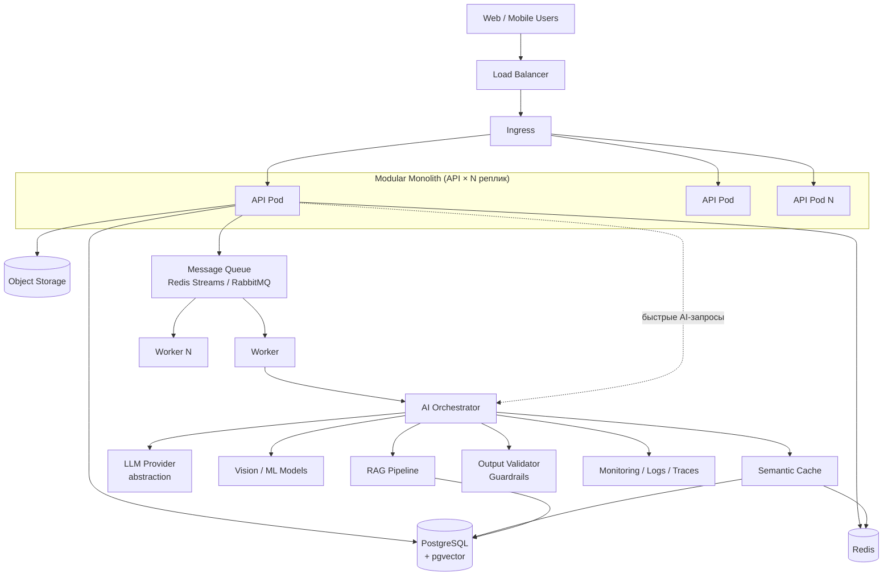

# 1. Архитектурный обзор

## 1.1 Задача

Платформа должна работать для **любого** AI-кейса (agriculture, fintech, healthcare, retail,
education и т.д.) без переписывания инфраструктуры. Всё, что специфично для кейса,
изолировано в один модуль — `domain/`. Когда кейс объявят завтра в 13:00, вы переименовываете
и наполняете `domain/`, всё остальное уже работает.

## 1.2 Принципы

### Модульный монолит, а не микросервисы
Один деплоюмый сервис с чёткими внутренними границами:

```
auth/            — аутентификация, JWT, роли
users/           — пользователи
domain/          — <<< СЮДА кейс-специфичная бизнес-логика (Farms/Crops → Orders/Patients/…)
ai/              — LLM-абстракция, оркестратор
rag/             — retrieval-augmented generation
cache/           — semantic + regular cache
files/           — object storage
notifications/   — уведомления
```

За 5 часов вы физически не успеете и не должны городить микросервисы — это прямой путь
потерять баллы на "Результат и качество решения" (нерабочая интеграция между сервисами —
частая причина провала на техотборе). Модульность даёт те же архитектурные плюсы
(чёткие границы, легко выделить в сервис позже — см. "Потенциал развития" в критериях
Demo Day), но без операционной сложности сети/деплоя нескольких сервисов за ночь.

### Stateless API
API-под не хранит важное состояние в памяти процесса. Состояние — в:
- PostgreSQL (данные)
- Redis (кэш, сессии, rate-limit, локи)
- Object Storage (файлы)
- pgvector (эмбеддинги)

Следствие: `API ×N` реплик можно поднимать/гасить не думая — это и есть
"масштабируемость" из критериев оценки, причём бесплатно, если сделать stateless с самого начала.

### Асинхронная обработка тяжёлых операций
HTTP-запрос никогда не блокируется на LLM-вызове дольше пары секунд, на анализе
изображений, генерации отчётов. Паттерн: `API → создать Job → очередь → Worker → результат
в БД → клиент поллит /jobs/{id}` (детали в [04](04-api-specification.md)).

### AI Provider Independence
Бизнес-логика никогда не вызывает OpenAI/Anthropic/etc напрямую — только через
`LLMProvider` интерфейс. Если на демо откажет один провайдер или кончится лимит — вы
меняете `.env`, а не код. Подробности в [02](02-ai-llm-pipeline.md).

## 1.3 Высокоуровневая схема



## 1.4 Зачем это именно так — привязка к критериям Demo Day

| Критерий Demo Day | Как архитектура на это работает |
|---|---|
| Результат и качество решения (20) | Stateless + очередь ⇒ ничего не падает под демо-нагрузкой; health checks дают предсказуемое поведение |
| Потенциал развития и масштабирования (20) | Модульный монолит явно готов к вырезанию модулей в сервисы; HPA описан заранее |
| Инновационность (15) | Semantic cache + guardrails — не всегда делают за 5 часов, это выделяет решение технически |
| Презентация, демо (20) | Готовый README/скрипт запуска = можно поднять локально за 2 минуты перед жюри, не зависеть от wifi площадки |
| Ценность решения (25) | Не архитектурный, а продуктовый критерий — архитектура тут только не должна мешать быстро сделать сценарий кейса (см. [07](07-hackathon-execution-plan.md)) |

Также напрямую закрывает технический допуск: п. 5.4.15 (README с архитектурой,
инструкциями запуска) и п. 5.6.6 (проверка функциональности без личных аккаунтов —
поэтому все внешние сервисы обёрнуты, с demo/mock режимом, см. [02](02-ai-llm-pipeline.md) §2.6).
