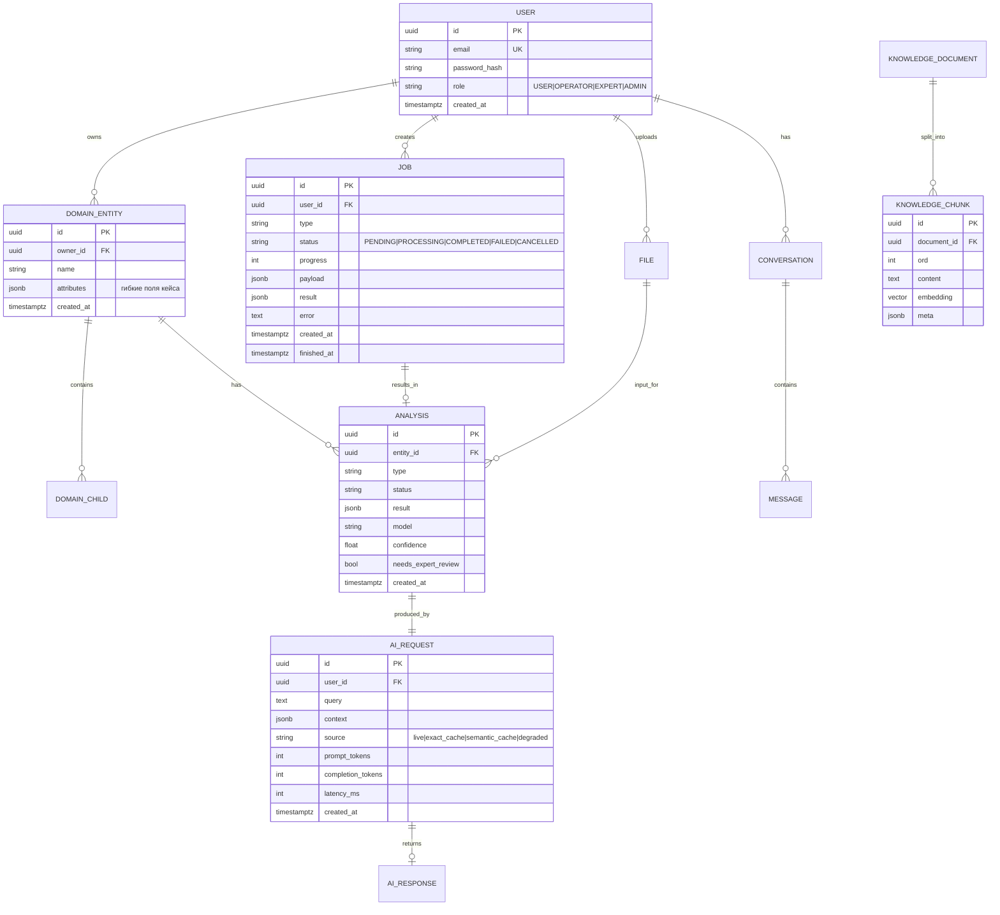
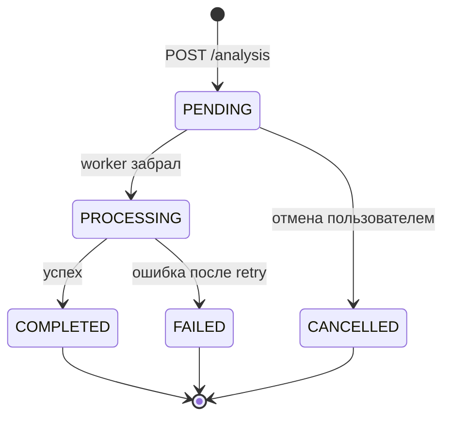

# 3. Данные

Одна PostgreSQL 16 + расширение `pgvector`. Отдельную векторную БД (Qdrant/Weaviate)
на хакатоне не берём: +1 контейнер, +1 точка отказа, +время на интеграцию, а выигрыша
на объёмах демо нет. В «Future» колонке архитектурного решения это упомянуто как
следующий шаг — этого достаточно для критерия масштабируемости.

## 3.1 ER-схема



`DOMAIN_ENTITY` — плейсхолдер. Завтра это `Farm`, `Patient`, `Vacancy`, `Shipment` —
зависит от кейса. Всё остальное не меняется.

> Совет по скорости: держите в `DOMAIN_ENTITY.attributes JSONB` всё, что не нужно
> индексировать. За 5 часов вы не успеете гонять миграции на каждое новое поле,
> а JSONB позволяет менять форму данных без `alembic revision`. Ключевые поля
> (то, по чему фильтруете и джойните) — обычными колонками.

## 3.2 Обязательная инициализация

```sql
CREATE EXTENSION IF NOT EXISTS "pgcrypto";   -- gen_random_uuid()
CREATE EXTENSION IF NOT EXISTS "vector";     -- pgvector
CREATE EXTENSION IF NOT EXISTS "pg_trgm";    -- для hybrid search (опционально)
```

Кладите это первой миграцией Alembic — забытый `CREATE EXTENSION vector` на чужой
машине ломает запуск у технического эксперта, а это п. 5.4.16 (недопуск).
Лучше — в `docker-entrypoint-initdb.d/00-extensions.sql`, тогда работает даже до миграций.

## 3.3 Индексы, которые реально нужны

```sql
CREATE INDEX ON analysis (entity_id, created_at DESC);
CREATE INDEX ON job (user_id, status, created_at DESC);
CREATE INDEX ON ai_request (user_id, created_at DESC);
CREATE INDEX ON message (conversation_id, created_at);

CREATE INDEX ON knowledge_chunk USING hnsw (embedding vector_cosine_ops);
CREATE INDEX ON semantic_cache  USING hnsw (embedding vector_cosine_ops);
CREATE INDEX ON semantic_cache  (context_key, expires_at);

-- hybrid search (если делаете)
CREATE INDEX ON knowledge_chunk USING gin (to_tsvector('simple', content));
```

## 3.4 Job Lifecycle



Правила:
- Job идемпотентен по `idempotency_key` — повторный POST не создаёт второй job.
- `PROCESSING` с `updated_at` старше 10 минут → возвращается в `PENDING` (watchdog);
  иначе упавший воркер вешает задачу навсегда, и это видно прямо на демо.
- `progress` (0–100) обновляется воркером — без него UI выглядит зависшим.

## 3.5 Connection pooling

```
DB_POOL_SIZE=10          # на один API-под
DB_MAX_OVERFLOW=5
DB_POOL_TIMEOUT=30
```

Важно при HPA: `max_connections` Postgres (обычно 100) должен быть ≥
`(API реплики + воркеры) × (pool_size + overflow)`. При 10 подах × 15 = 150 —
Postgres откажет. Либо ограничьте `maxReplicas`, либо поставьте PgBouncer
(упомянуть в «Future» — этого хватит).

## 3.6 Бэкапы (для слайда про продакшн)

- `pg_dump` по расписанию в Object Storage, retention 7 дней.
- Object Storage: versioning включён.
- Всё состояние восстановимо из: БД-дампа + бакета + Git (манифесты K8s).
