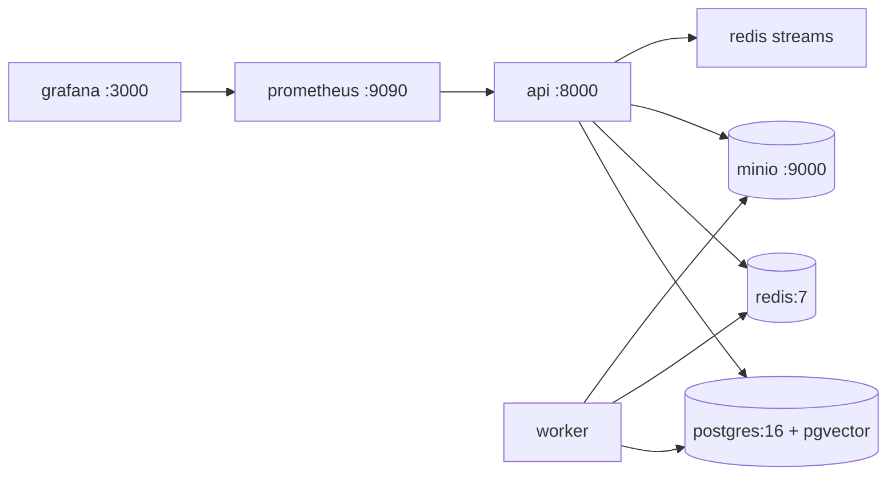
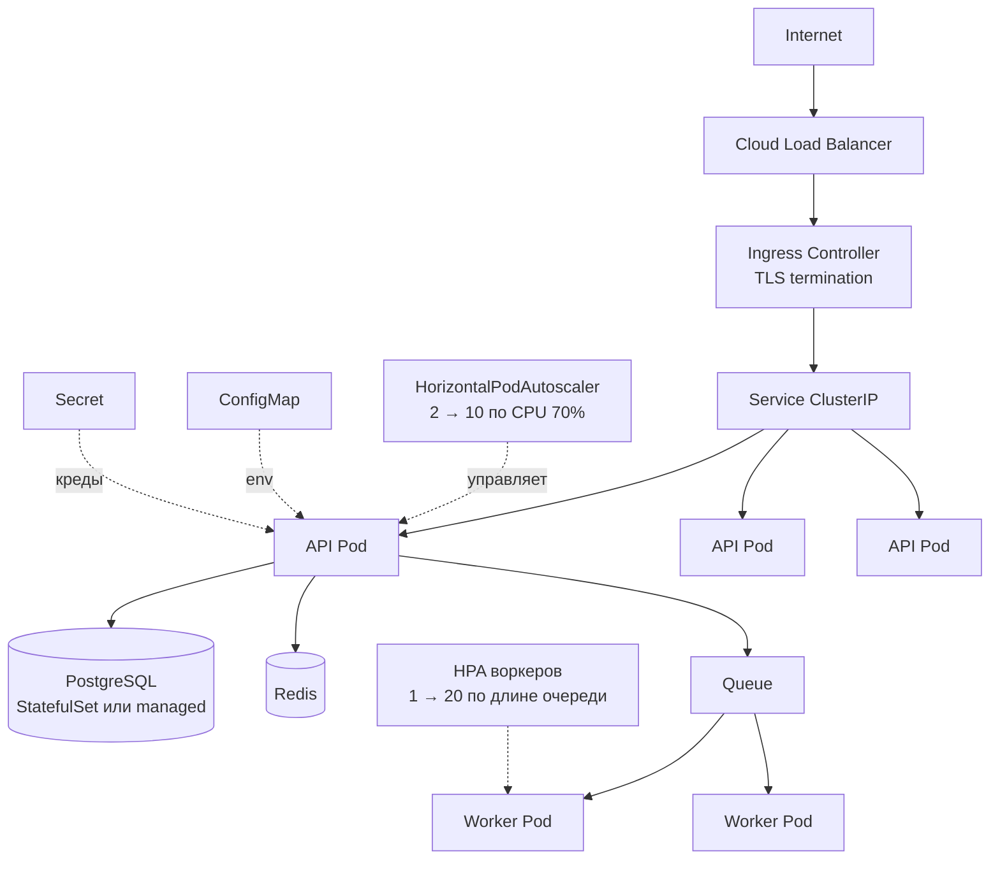
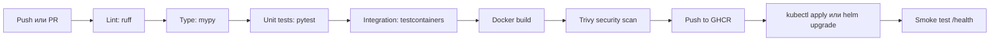

# 5. Деплой, контейнеризация, масштабирование

Критерий «лёгкость деплоя» на техотборе проверяется буквально: эксперт клонирует репо,
читает README, выполняет команды. Если не поднялось — команда выбывает без права
на пояснения (п. 5.4.16). Поэтому цель: **одна команда от `git clone` до рабочего приложения.**

```bash
git clone <repo> && cd <repo>
cp .env.example .env
docker compose up -d
# http://localhost:8000/docs — API
# http://localhost:8000/health — должен вернуть 200
```

Никаких «установите Poetry, создайте БД, примените миграции вручную». Миграции
применяются автоматически при старте контейнера, сид-данные загружаются автоматически.

## 5.1 Dockerfile (multi-stage)

```dockerfile
# infra/docker/backend.Dockerfile
FROM python:3.12-slim AS builder
WORKDIR /app
RUN pip install --no-cache-dir uv
COPY pyproject.toml uv.lock ./
RUN uv export --no-dev --format requirements-txt > req.txt \
 && pip install --no-cache-dir --prefix=/install -r req.txt

FROM python:3.12-slim AS runtime
RUN useradd -m -u 1000 app
COPY --from=builder /install /usr/local
WORKDIR /app
COPY --chown=app:app . .
USER app
EXPOSE 8000
HEALTHCHECK --interval=15s --timeout=3s --start-period=20s --retries=3 \
  CMD python -c "import urllib.request;urllib.request.urlopen('http://localhost:8000/health')"
ENTRYPOINT ["/app/scripts/entrypoint.sh"]
CMD ["uvicorn", "app.main:app", "--host", "0.0.0.0", "--port", "8000"]
```

Почему так:
- **multi-stage** — образ ~200 МБ вместо ~1.2 ГБ; собирается и пушится быстрее (важно в CI на хакатоне).
- **non-root user** — стандартное требование security-скана, спросят на техотборе.
- **HEALTHCHECK** — docker-compose и K8s знают, когда контейнер реально готов.
- Один и тот же образ для API и воркера — меняется только команда запуска. Не нужно
  собирать два образа и синхронизировать зависимости.

`scripts/entrypoint.sh`:
```bash
#!/usr/bin/env sh
set -e
alembic upgrade head                    # миграции при старте
[ "$SEED_ON_START" = "true" ] && python -m app.scripts.seed || true
exec "$@"
```

## 5.2 Локальная среда — docker-compose

Полный файл: [`../docker-compose.yml`](../docker-compose.yml). Состав:



Prometheus/Grafana — опционально, под профилем `observability`, чтобы базовый
`docker compose up` был быстрым:

```bash
docker compose up -d                         # только необходимое
docker compose --profile observability up -d # + мониторинг для демо
```

## 5.3 Kubernetes

Манифесты: [`../infra/k8s/`](../infra/k8s/). Применяются одной командой:

```bash
kubectl apply -k infra/k8s/
```



### Состав манифестов

| Файл | Назначение |
|---|---|
| `namespace.yaml` | изоляция |
| `configmap.yaml` | несекретная конфигурация |
| `secret.yaml` | шаблон секретов (реальные значения — НЕ в git) |
| `stateful-services.yaml` | PostgreSQL (StatefulSet + PVC) и Redis; в проде — managed |
| `api-deployment.yaml` | 3 реплики, probes, resources, PDB |
| `api-service.yaml` | ClusterIP |
| `worker-deployment.yaml` | воркеры, без Service |
| `hpa.yaml` | автоскейлинг API (2→10) и воркеров (1→20) |
| `ingress.yaml` | маршрутизация + TLS |
| `kustomization.yaml` | всё одной командой |

### Ключевые фрагменты

**Probes — разделяйте liveness и readiness.** Самая частая ошибка: одна и та же
ручка на оба. Если readiness проверяет БД и вы вешаете её на liveness, то при
кратковременной недоступности БД Kubernetes начнёт **перезапускать** поды вместо
того, чтобы просто убрать их из балансировки — каскадный отказ прямо на демо.

```yaml
livenessProbe:
  httpGet: { path: /health, port: 8000 }   # только «процесс жив»
  initialDelaySeconds: 20
  periodSeconds: 15
readinessProbe:
  httpGet: { path: /ready, port: 8000 }    # БД + Redis доступны
  initialDelaySeconds: 5
  periodSeconds: 5
  failureThreshold: 3
```

**Resources — обязательны, иначе HPA не работает.** HPA считает утилизацию от
`requests`; без них автоскейлинг по CPU просто не запустится.

```yaml
resources:
  requests: { cpu: "250m", memory: "256Mi" }
  limits:   { cpu: "1000m", memory: "1Gi" }
```

**Rolling update без простоя:**

```yaml
strategy:
  type: RollingUpdate
  rollingUpdate: { maxSurge: 1, maxUnavailable: 0 }
```

`maxUnavailable: 0` — во время деплоя всегда есть живые поды.

**Graceful shutdown** — иначе при скейлдауне рвутся запросы:

```yaml
terminationGracePeriodSeconds: 30
lifecycle:
  preStop:
    exec: { command: ["sleep", "5"] }   # дать LB убрать под из ротации
```

В приложении: обработчик `SIGTERM` дожидается текущих запросов, воркер — дорабатывает
текущий job и не берёт новый.

## 5.4 Стратегия масштабирования

```
                 Load Balancer
                       │
        ┌──────────────┼──────────────┐
      API 1          API 2          API N        ← HPA по CPU/RPS (2→10)
        └──────────────┼──────────────┘
                     Queue
        ┌──────────────┼──────────────┐
     Worker 1       Worker 2       Worker N      ← HPA по длине очереди (1→20)
```

Ключевая мысль для жюри: **API и воркеры скейлятся независимо**. AI-нагрузка обычно
упирается не в HTTP, а в LLM-вызовы; при всплеске растёт очередь, а не latency API.
Именно это отличает архитектуру, рассчитанную на AI-трафик.

Скейлинг воркеров по длине очереди (KEDA, если кластер позволяет):

```yaml
apiVersion: keda.sh/v1alpha1
kind: ScaledObject
spec:
  scaleTargetRef: { name: worker }
  minReplicaCount: 1
  maxReplicaCount: 20
  triggers:
    - type: redis
      metadata: { listName: ai_jobs, listLength: "5" }
```

Если KEDA нет — обычный HPA по CPU, а KEDA упомянуть как следующий шаг.

Слои масштабирования по порядку исчерпания:
1. Stateless API → горизонтально, без ограничений.
2. Воркеры → горизонтально, упираются в лимиты LLM-провайдера (отсюда важность semantic cache).
3. PostgreSQL → connection pooling → read replicas → партиционирование.
4. Redis → одиночный → Sentinel/Cluster.
5. Object Storage → изначально безграничен.

## 5.5 CI/CD



`.github/workflows/ci.yml` (минимум, который стоит иметь):

```yaml
name: CI
on: [push, pull_request]
jobs:
  test:
    runs-on: ubuntu-latest
    services:
      postgres:
        image: pgvector/pgvector:pg16
        env: { POSTGRES_PASSWORD: postgres }
        options: >-
          --health-cmd pg_isready --health-interval 10s --health-retries 5
      redis:
        image: redis:7-alpine
    steps:
      - uses: actions/checkout@v4
      - uses: astral-sh/setup-uv@v3
      - run: uv sync
      - run: uv run ruff check .
      - run: uv run pytest -q
  build:
    needs: test
    runs-on: ubuntu-latest
    steps:
      - uses: actions/checkout@v4
      - run: docker build -f infra/docker/backend.Dockerfile -t app:${{ github.sha }} .
```

Зелёный CI-бейдж в README — дешёвый и заметный сигнал качества для технического эксперта.
Даже если тестов немного, факт работающего пайплайна отличает вас от большинства команд.

## 5.6 Конфигурация

Ничего среда-зависимого в коде. Полный список — [`../.env.example`](../.env.example).

```
APP_ENV=dev|staging|prod
DATABASE_URL=
REDIS_URL=
S3_ENDPOINT= S3_BUCKET= S3_ACCESS_KEY= S3_SECRET_KEY=
LLM_MODE=live|mock
LLM_PRIMARY= LLM_FALLBACK= LLM_API_KEY=
EMBEDDING_MODEL= EMBEDDING_DIM=1536
SEMANTIC_CACHE_ENABLED=true SEMANTIC_CACHE_THRESHOLD=0.92 SEMANTIC_CACHE_TTL=86400
RAG_TOP_K=5 RAG_MIN_SIMILARITY=0.5
RATE_LIMIT_ANON=20 RATE_LIMIT_USER=100 RATE_LIMIT_AI=20
MAX_FILE_SIZE_MB=20
JWT_SECRET= JWT_EXPIRE_MINUTES=60
LOG_LEVEL=INFO LOG_FORMAT=json
```

Валидация конфига при старте через `pydantic-settings`: приложение падает сразу
с понятным сообщением, если переменная не задана, а не через 10 минут на первом
AI-запросе во время демо.

## 5.7 Infrastructure as Code

Terraform для облачных ресурсов (кластер, managed Postgres/Redis, бакет, registry, LB).
Для хакатона достаточно `infra/terraform/` со скелетом и README-описанием — это
предъявляется как продакшн-слой деплоя, даже если MVP крутится в docker-compose.
Тратить на реальный `terraform apply` время соревновательной части не стоит.
