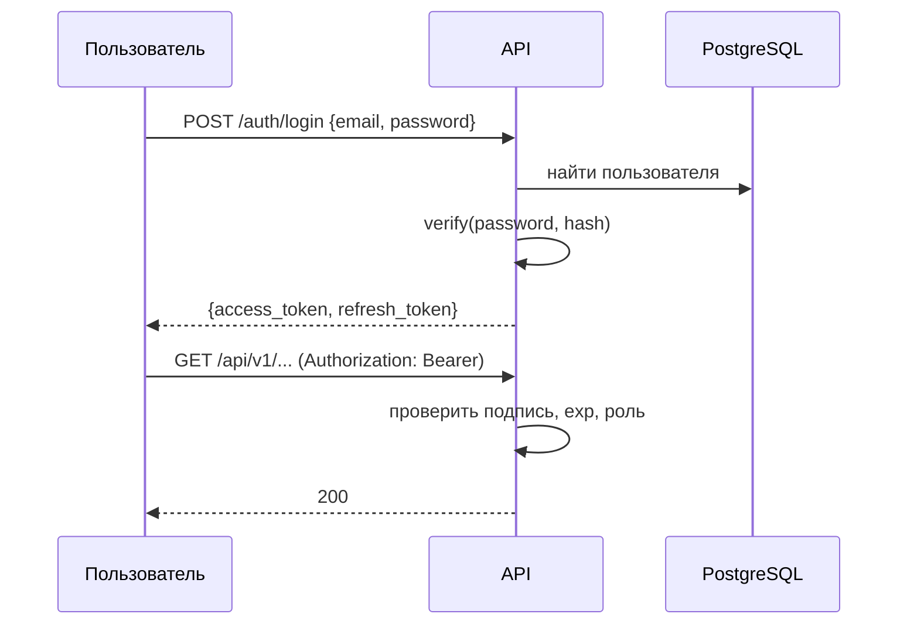

# 6. Безопасность и наблюдаемость

## 6.1 Аутентификация

JWT: короткий access (60 мин) + refresh. Пароли — `argon2` (или `bcrypt`), никогда
не самодельный хэш и никогда не открытым текстом.



## 6.2 Авторизация (RBAC)

```
USER      → свои объекты: чтение/создание
OPERATOR  → объекты своей организации, запуск анализа
EXPERT    → просмотр назначенных данных, верификация AI-рекомендаций, база знаний
ADMIN     → всё + управление пользователями и системой
```

Проверка — на уровне сервиса, не только в роутере: иначе новый эндпоинт,
добавленный в спешке в последний час, окажется без защиты.

```python
@router.get("/entities/{id}")
async def get_entity(id: UUID, user: User = Depends(current_user)):
    entity = await service.get(id)
    authorize(user, "entity:read", entity)   # бросает 403
    return entity
```

## 6.3 Rate limiting

Распределённый, на Redis (не in-memory — иначе при N подах лимит умножается на N).
Sliding window или token bucket:

```python
async def allow(key: str, limit: int, window_s: int) -> bool:
    now = time.time()
    p = redis.pipeline()
    p.zremrangebyscore(key, 0, now - window_s)
    p.zadd(key, {str(uuid4()): now})
    p.zcard(key)
    p.expire(key, window_s)
    _, _, count, _ = await p.execute()
    return count <= limit
```

```
Аноним:          20 req/min
Аутентифицирован: 100 req/min
AI-эндпоинты:     20 req/min  ← отдельный, строгий лимит
```

AI-ручки лимитируются отдельно: один пользователь не должен сжечь квоту LLM
на весь демо-стенд. При превышении — 429 + `Retry-After`, а не молчаливое ожидание.

## 6.4 Секреты

- Никогда в Git. `.env` в `.gitignore`, в репо только `.env.example` с пустыми значениями.
- В K8s — `Secret` (в идеале External Secrets / Vault, для хакатона достаточно `Secret`
  + заметка, что в проде — менеджер секретов).
- Перед финальным коммитом прогнать `git log -p | grep -iE "api[_-]?key|secret|password"` —
  утёкший ключ в истории это и инцидент, и повод для вопросов на техотборе.

## 6.5 Защита API

| Мера | Реализация |
|---|---|
| Валидация входа | Pydantic на каждой ручке, строгие типы |
| SQL-инъекции | только параметризованные запросы / ORM, никаких f-строк в SQL |
| Загрузка файлов | проверка magic bytes, whitelist MIME, лимит размера, случайные имена в хранилище |
| CORS | явный whitelist origin, не `*` |
| Security headers | HSTS, X-Content-Type-Options, X-Frame-Options, CSP |
| HTTPS | TLS на Ingress |
| Prompt injection | Input Guard, см. [02](02-ai-llm-pipeline.md) §2.5 |
| SSRF | если ходите по URL пользователя — запрет private IP ranges |

## 6.6 Логирование

Структурированный JSON, одна строка — одно событие:

```json
{
  "timestamp": "2026-09-23T14:30:00Z",
  "level": "INFO",
  "service": "ai-orchestrator",
  "request_id": "req-8f72b1",
  "user_id": "user-456",
  "event": "llm_request",
  "model": "claude-sonnet-5",
  "latency_ms": 820,
  "prompt_tokens": 1240,
  "cache_hit": false,
  "validation_retries": 0
}
```

**Не логировать никогда:** пароли, токены, API-ключи, полные тексты с PII,
содержимое медицинских/финансовых записей. Заведите `redact()` и прогоняйте через
него контекст лога — на ревью кода это замечают.

## 6.7 Метрики (Prometheus)

```
# Инфраструктура
process_cpu_seconds_total, process_resident_memory_bytes

# API
http_requests_total{method, path, status}
http_request_duration_seconds{path}   # гистограмма → p50/p95/p99

# Очередь
queue_depth{queue}
job_duration_seconds{type}
jobs_total{type, status}

# AI (см. 02 §2.7)
ai_cache_hits_total{level}, ai_cache_misses_total
ai_tokens_total{model, kind}
ai_validation_failures_total{rule}
ai_estimated_cost_usd_total
```

Целевые показатели (для слайда «Нефункциональные требования»):
- API p95 < 500 мс для не-AI запросов
- Semantic cache hit rate > 30% на типичном трафике
- Доступность: API реплик ≥ 2, отсутствие единой точки отказа на уровне приложения

## 6.8 Трейсинг

OpenTelemetry (**не реализован, план на будущее**), спаны по стадиям — это
буквально отвечало бы на вопрос «где тормозит»:

```
request (1240 ms)
├── auth              (2 ms)
├── exact_cache       (1 ms)   MISS
├── embedding        (110 ms)
├── semantic_cache    (8 ms)   MISS
├── rag_retrieval    (140 ms)
├── llm_call         (950 ms)  ← узкое место
└── validation        (4 ms)
```

Такой разбор на слайде отвечает на вопрос жюри «а вы мерили?» лучше любых слов.

## 6.9 Health checks

```python
@app.get("/health")            # liveness — ничего внешнего не трогаем
async def health():
    return {"status": "ok", "version": settings.VERSION}

@app.get("/ready")             # readiness — зависимости
async def ready():
    checks = {
        "database": await check_db(),
        "redis": await check_redis(),
        "storage": await check_s3(),
    }
    ok = all(checks.values())
    return JSONResponse({"ready": ok, "checks": checks},
                        status_code=200 if ok else 503)
```

`/ready` с детализацией по зависимостям — первое, что откроет технический эксперт,
если что-то не завелось. Он же сразу покажет, что именно не поднялось.
